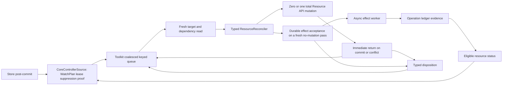
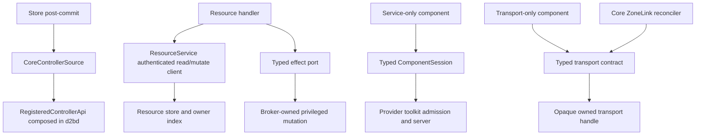
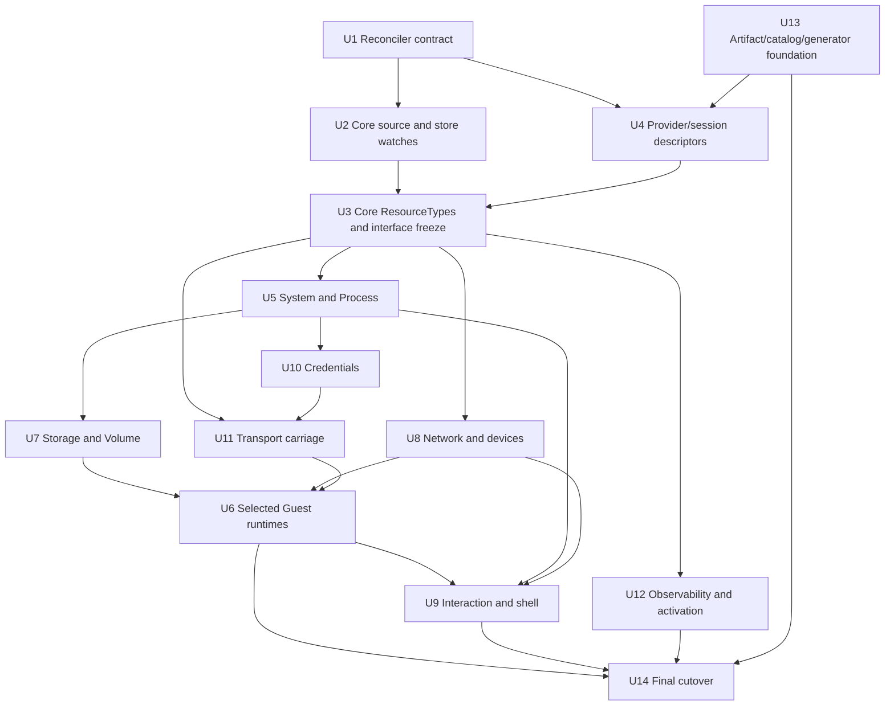

# Generic Resource Reconciler and Provider Framework Cutover - Plan

## Goal Capsule
- **Objective:** Make one owner-aware asynchronous reconciler the only
  production resource scheduler and cut all 27 Providers to typed resource,
  service, and transport boundaries.
- **Authority:** User-confirmed #487 scope, `STRATEGY.md`, ADR-046
  specifications, and `docs/contributing/critical-subsystems.md`.
- **Starting point:** Adapt existing toolkit, ResourceService, store,
  core-controller, daemon, ComponentSession, and Provider surfaces; add no
  parallel machinery.
- **Completion:** Every Provider has artifact, descriptor, registration,
  Dossier, test, and target evidence; no snapshot loop, fixed sleep, direct
  completion wait, or alternate scheduler remains.
- **Boundary:** Core owns watch plans, suppression, hints, leases, and
  `CommittedRevisionProof` (store post-commit -> Core -> toolkit queue).
  ResourceService is handler-client-only; service/transport components use
  typed ComponentSession/toolkit contracts, with no universal RPC or
  zero-resource reconciler.

## Product Contract
### Preservation and change note
The Product Contract adds R21-R30 and AE11-AE15 for user-confirmed #487 and
full 27-Provider scope; this is not a no-scope-change claim. A1-A4, R1-R20,
F1-F4, and AE1-AE10 remain preserved, with catalog, boundary, and cutover proof
made explicit.

### Summary
d2b has bounded ResourceReconciler, API/store, Provider, and ComponentSession
primitives, but production paths are fragmented. This work makes the shared
runner the only resource scheduler while preserving typed decisions. It uses
level-triggered hints, fresh reads, exact fences, single-flight, fair queues,
durable evidence, bounded owner propagation, declared repair, and relist.
`CoreControllerSource` validates the plan; d2bd composes
`RegisteredControllerApi`; handlers await acceptance, never completion.

### Problem Frame
The repository has bounded reconciler/Core primitives and API/store contracts,
but production still has snapshot loops, fixed polling, direct completion
waits, and broad error propagation. The split permits false Provider readiness
without complete artifact, descriptor, registration, Dossier, test, or target
evidence, while legacy `HostJson` competes with resource-owned inputs.

### Actors
- A1. **Reconciliation engine:** intake, queueing, single-flight, fairness,
  retries, status, repair, and restart recovery.
- A2. **Typed resource controller:** fresh reads, domain decisions, mutations,
  effect requests, observations, and dispositions.
- A3. **Effect worker:** post-acceptance work, monotonic evidence, and owner
  wakeups.
- A4. **API/store/session boundary:** authorization, revisions, ownership,
  ComponentSession identity, commits, hints, and deletion eligibility.

### Key Decisions

- **Promote and tighten the existing `d2b-controller-toolkit` over a rewrite.**
  (session-settled: user-directed - chosen over replacing tested primitives:
  existing queue, identity, status, and effect contracts already support one
  scheduler.) Governs R1-R4 and R18-R20.
- **Use one shared engine with typed handlers.** (session-settled:
  user-directed - chosen over scheduler-only or universal state-machine paths:
  scheduling is common while Provider/resource semantics remain owner-local.)
  Governs R1-R2, R4, R13, and R17-R20.
- **Complete the cutover instead of retaining compatibility.** (session-settled:
  user-directed - chosen over a compatibility executor or bridge: two schedulers
  preserve conflicting authority.) Governs R18-R20, R28, and R30.
- **Allow zero or one total Resource API mutation transaction per reconcile.**
  (session-settled: user-directed - latest choice over the prior
  multi-related-transaction shape: successful mutation or conflict returns
  immediately and child progress is retained across fresh passes.) Governs
  R5-R7 and R12.
- **Propagate owner wakeups through bounded exact-UID ancestors.**
  (session-settled: user-directed - chosen over direct-owner-only wakeups:
  bounded evidence preserves convergence without widening authority.) Governs
  R11 and R17.
- **Make repair controller-declared.** (session-settled: user-directed -
  chosen over universal repair: opt-out requires wakeup, watch-recovery, and
  restart-relist evidence.) Governs R14-R15.
- **Retain committed partial progress instead of undoing it.** (session-settled:
  user-directed - chosen over whole-pass compensation: durable related progress
  is repaired from fresh state.) Governs R5-R7 and R16-R17.
- **Absorb issue #487 into this combined plan.** (session-settled:
  user-directed - chosen over a separate prerequisite: both changes share
  authority, catalog, and migration boundaries.) Governs R18-R25 and R30.
- **Complete all 27 accepted Providers instead of only a production-only
  subset.** (session-settled: user-directed - the accepted catalog requires
  complete artifact, descriptor, registration, test, and target evidence.)
  Governs R21-R22, R24, and R27-R30.
- **Use Provider toolkit sessions for service-only components.** (session-settled:
  user-directed - chosen over zero-resource reconcilers: services/transports
  need typed ComponentSession boundaries.) Governs R23 and R26-R27.

### Requirements

#### Shared execution contract

- R1. Every production resource controller runs through one shared engine with typed handlers.
- R2. Wakeups are level-triggered hints and never prescribe an action.
- R3. Same-resource identity is serialized; independent identities run within
  declared budgets.
- R4. Each phase reads a fresh target and dependencies; no later phase uses a pre-commit snapshot.
- R5. A pass commits zero or one total Resource API mutation transaction, whether self, related, status, or finalizer; a successful mutation or conflict returns immediately.
- R6. Related-resource progress is retained across fresh passes and repaired from fresh state without undoing durable commits.
- R7. Every mutation carries exact resource UID, generation, revision, operation ID, ownership, Provider/controller generations, assignment epoch, and applicable session/reconnect generation; conflicts discard stale intent.

#### Async effects and status

- R8. A handler awaits durable mutation or effect acceptance, never long-running completion; a fresh pass selects acceptance only after required resource commits and returns after acceptance.
- R9. The existing Operation ledger owns in-flight effect/upgrade identity, idempotency, accepted/running/uncertain progress, and retry transaction progress. Resource status owns bounded completed/failed/current observations; matching persisted status/ledger evidence is authoritative during owner reconcile, while direct probes stay in workers/declared repair and persist evidence before projection. Persist ledger progress, then eligible status, then wakeup the exact owner after every readiness-changing transition (including session establishment, launch/observation, stop, StoreSync, device setup, failure, uncertainty, and recovery).
- R10. Mismatched UID, generation, operation, Provider/controller generation, assignment epoch, or session/reconnect fence cannot mutate state. Resource revision is an optimistic mutation precondition, not runtime/effect identity, and a status/finalizer revision advance cannot by itself invalidate matching in-flight or running work. `Uncertain` never means completed or never accepted, cannot clear a finalizer, and is observed/quarantined before any new fenced operation.
- R11. Core validates plans, leases, suppression, and coalesced hints; child commits capture old/new exact owner identities before the same-transaction `owner_index` update, dispatch non-droppable deletion/reparent/finalizer hints after commit, and wake bounded ancestors. Related transactions against an old owner fence fail. The receiver fresh-reads, and dropped wakeups still converge through watch recovery, declared repair, or restart relist. Watched configuration is not an ownership edge.
- R12. Status is an observation projection. Any successful Resource API mutation or conflict returns immediately; no stale status/effect follows, and status is deferred when a self mutation occurred.
- R13. Waiting, conflict, retryable failure, terminal failure, degradation, and completion are distinct typed dispositions; handlers do not sleep.

#### Repair, deletion, and isolation

- R14. Every Provider descriptor declares bounded repair or opts out with durable wakeup, watch-recovery, and restart-relist evidence; retain Device/GPU 30 s default/60 s maximum and notification/audio 5 m bounds.
- R15. Disconnect, expiry, controller/daemon restart, and new ComponentSession generation relist ledger rows by UID/generation/operation identity, never status alone, without duplicate effects; new generations admit new work but preserve matching rows, reject mismatched desired generations, and never reaccept an operation ID.
- R16. First reconcile installs the exact finalizer and returns. Controllers request child deletion, clear only their finalizer, and never physically remove the resource they reconcile; the store physically removes an eligible Delete/finalizer transaction only with no finalizers, owned children, Endpoints, or structural fences.
- R17. An error, panic, cancelled effect, unavailable dependency, or retry budget cannot starve unrelated resources; only the failed identity retries.

#### Migration and compatibility

- R18. Remove whole-snapshot loops, fixed polling sleeps, direct completion waits, and duplicate per-controller schedulers.
- R19. Reuse existing ownership, owner-index, hint, store, and Resource API
  primitives when they satisfy this contract.
- R20. Preserve Process fast-path responsiveness, bounded queues, backpressure, cancellation, leases, and expedited single-flight from `docs/specs/ADR-046-resource-reconciliation.md`; D090 uses Core-gated `CommittedRevisionProof`/`PriorityLane`, and D091 upgrades share per-resource single-flight.

#### Provider framework and catalog

- R21. The committed/private Provider catalog is the sole source for accepted identities, descriptors, artifact metadata, registration, and assignment; generated/runtime copies cannot expand it.
- R22. Each of 27 identities has a real signed artifact and descriptor; signed no-binary `system-core` remains the fixed exception.
- R23. Resource-backed owners use `ResourceService`/`Reconciler`; service/transport-only components use `ProviderEntrypoint`/`ComponentSession`; neither substitutes for the other.
- R24. Admission/assignment binds Provider, artifact/descriptor digests, component/controller, target kind, Zone, resource UID/generation, session generation, and assignment key; mismatch/replay fails closed.
- R25. Issue #487 is an in-plan prerequisite; completion cannot rely on a separate deliverable or bridge.
- R26. No universal Provider RPC catalogue, invented method enum, generic proxy, or zero-resource scheduling path; typed contracts remain owner-local.
- R27. Completion has no scaffold, placeholder, `78` stub, missing artifact, incomplete dossier, or unregistered accepted Provider.
- R28. Catalog owns identities, packages own artifacts/descriptors, dossiers own behavior/evidence, and existing tests/Bazel targets own verification.
- R29. Artifacts use one canonical layout, real Ed25519 verification, all declared binaries, multi-binary support, and only the fixed `system-core` exception.
- R30. Final evidence proves all 27 rows' identity, artifact, descriptor, registration, assignment, source, dossier, test, target, and status plus legacy `HostJson`/scheduler removal; skips are not proof.

### Key Flows

- F1. **Ordinary convergence:** Store post-commit flows through Core
  `WatchPlan` validation, lease/suppression, proof, and coalesced hints; the
  runner fresh-reads, commits zero or one total Resource API mutation, and
  returns on commit or conflict. Covers R2-R7, R13, R17.
- F2. **Long-running effect:** A fresh pass accepts one fenced ledger operation,
  a worker claims it idempotently, evidence precedes eligible status and owner
  wakeup, and restart rejoins or fences recovery. Covers R8-R11 and R15.
- F3. **Owned graph progress:** The Provider selected by
  `Guest.spec.providerRef` owns that Guest graph; child Providers own effects.
  One related transaction per fresh pass retains durable progress and repairs
  from fresh state. Covers R5-R7 and R11.
- F4. **Deletion:** First reconcile enrolls a finalizer. Controllers request
  child deletion and clear only their finalizer; the store's foreground
  eligibility transaction performs physical removal. Covers R8-R10, R15-R16.

### Acceptance Examples

- AE1. **R2, R4, R7:** Coalesced hints cause one fresh decision, not replayed actions.
- AE2. **R3, R17:** One failing Process receives its retry policy while healthy identities progress.
- AE3. **R5, R6:** Each reconcile commits zero or one related/self/status/
  finalizer transaction; after related N succeeds, the durable progress remains
  for a fresh pass, and the next conflict returns. Crashes after related N,
  self mutation, or acceptance never duplicate or undo progress; status is
  deferred after self mutation.
- AE4. **R5, R12:** Any successful mutation or conflict returns immediately,
  blocks stale status/effect work, and fresh re-entry is required; a result with
  more than one Resource API mutation transaction is rejected.
- AE5. **R8-R10:** Restart relists by UID, generation, revision, operation ID,
  Provider/controller generations, assignment epoch, and applicable
  session/reconnect generation. Matching work rejoins; a missing/mismatched
  accepted row cannot start a duplicate effect; `Uncertain` is observed or
  quarantined before a new fenced operation. Completion after handler return
  wakes the owner to Ready without an unrelated Resource mutation.
- AE6. **R7, R13:** A conflict discards stale intent and schedules fresh re-entry without an in-handler loop.
- AE7. **R14, R15:** Repair opt-out is rejected without wakeup, expiry, and restart evidence.
- AE8. **R16:** Absent finalizer enrolls once and returns; enrollment conflict requeues fresh. Cleanup crash before clear, stale/ambiguous finalization evidence, event-only Delete after expiry, finalizer-free Delete, final-finalizer removal, child/Endpoint blocking, and NotFound preserve eligibility.
- AE9. **R11:** Reparent/delete captures old/new owners before the same-transaction index update and dispatches after commit; old fences fail, while old UID wakeup cannot transfer authority.
- AE10. **R18:** No active snapshot loop, fixed sleep, or direct completion wait remains.
- AE11. **Provider admission.** Given a registration/assignment, only a
  matching catalog row with signature, exact fences, and bounded repair or
  opt-out evidence is admitted; mismatch/replay fails before mutation. Covers
  R21-R24.
- AE12. **All-27 conformance.** Given the 27-row matrix, final conformance
  proves each canonical identity, signed artifact/`system-core` exception,
  descriptor, registration, assignment, dossier, source, test, target, and
  status. Covers R21-R22 and R27-R30.
- AE13. **Component boundary.** Resource owners use ResourceService/Reconciler,
  service/transport components use ProviderEntrypoint/ComponentSession, Core
  alone reconciles ZoneLink, Azure Relay only reads same-Zone Credentials via
  scoped client, and no universal RPC/zero-resource path exists. Covers R23,
  R26, and R28.
- AE14. **Tamper rejection.** Changed artifact, descriptor, catalog row,
  signature, digest, generation, or assignment key fails Ed25519/fence checks
  before effects; no fallback or scaffold is accepted. Covers R22, R24, R27,
  and R29.
- AE15. **Final cutover.** Final proof leaves no bridge, legacy HostJson
  authority, alternate scheduler, snapshot loop, polling sleep, direct
  completion wait, scaffold, `78` stub, or unregistered Provider; owner tests
  and Bazel targets provide all-row evidence. Covers R25 and R27-R30.

### Success Criteria

- All 27 accepted Providers map to exactly one unit and complete catalog row;
  all production resource controllers use the shared runner.
- ResourceService, typed ComponentSession, and typed transport boundaries stay
  distinct; Core owns source/watch plans, the ledger owns in-flight effects,
  and status owns bounded observations.
- Reaction gates bind p95 durable commit-to-handler start <=5 ms and p95 durable
  commit-to-launch-attempt <=20 ms for Process counts 1/10/100 to
  `CoreControllerSource`, durable ledger acceptance, and worker launch; startup
  relist is separately bounded. Coverage proves fairness, fresh reads, partial
  progress, fences, restart, deletion, isolation, and Provider lifecycle.
- Existing integration lanes prove only behavior that cannot be proven lower.

### Scope Boundaries

- No new contributor runtime, host distribution, Kubernetes framework, cache,
  background garbage collector, universal Provider RPC surface, or zero-resource
  reconciler; no local polling scheduler, source census, test inventory, or
  shell gate.
- The engine does not own Provider semantics, desired child graphs, or effects;
  existing Resource API, store, owner graph, sessions, and broker boundaries
  are adapted, and historical prose stays clearly non-current.

### Dependencies and Assumptions

- `docs/specs/ADR-046-resource-reconciliation.md` and
  `docs/specs/ADR-046-provider-model-and-packaging.md` remain baselines except
  for R21-R30. Existing store/API provide revisions, UID ownership, hints, and
  relist; Core provides `CoreControllerSource`, d2bd composes
  `RegisteredControllerApi`, and effects recover in the Operation ledger.
- Provider `all-tests` targets remain aggregate authority and `tests/AGENTS.md`
  governs coverage placement.
- Existing owner-hint bounds remain `MAX_OWNER_HINT_DEPTH = 8`,
  `MAX_OWNER_HINT_WORK_ITEMS = 64`, and `MAX_OWNER_CHILD_BATCH = 128`.

### Sources and Research

- `STRATEGY.md`; `docs/adr/0015-daemon-only-clean-break.md`;
  `docs/adr/0046-d2b-3-provider-control-plane.md`.
- `docs/specs/ADR-046-resource-reconciliation.md`;
  `docs/specs/ADR-046-resource-api-and-authorization.md`;
  `docs/specs/ADR-046-provider-model-and-packaging.md`;
  `docs/specs/ADR-046-provider-state.md`.
- `docs/specs/ADR-046-current-code-migration-map.md`;
  `docs/specs/ADR-046-reset-and-cutover.md`;
  `docs/specs/ADR-046-componentsession-and-bus.md`;
  `docs/specs/ADR-046-resources-host-guest-process-user.md`.
- [Issue #487](https://github.com/vicondoa/d2b/issues/487);
  [Issue #489](https://github.com/vicondoa/d2b/issues/489).
- [Kubernetes controller concepts](https://kubernetes.io/docs/concepts/architecture/controller/);
  [controller-runtime](https://github.com/kubernetes-sigs/controller-runtime);
  [reconcile API](https://pkg.go.dev/sigs.k8s.io/controller-runtime/pkg/reconcile).
- [kube-rs](https://kube.rs/); [kube-rs controllers](https://kube.rs/controllers/overview/);
  [Crossplane compositions](https://docs.crossplane.io/latest/concepts/compositions/).

## Planning Contract

**Plan shape:** One dependency-ordered implementation plan owns the shared reconciler, production ResourceService adapter, Provider catalog and artifacts, all 27 rows, and final legacy removal, with no compatibility bridge, universal RPC surface, zero-resource reconciler, or new gate.

### Key Technical Decisions

- KTD1. **Decision.** Extend the existing `ReconcileResult` and `Runner`, rather than replacing them: each reconcile result contains zero or one total Resource API mutation transaction (none, self, related, status, or finalizer) and returns immediately after commit or conflict; a bounded `ResourceMutationBatch` may contain multiple mutation items but is one transaction. `MAX_OWNER_CHILD_BATCH = 128` bounds desired-graph size, not permission for multiple transaction batches; Core owner reconciliation emits at most one related child mutation transaction per fresh pass. Child progress spans fresh passes, and durable effect acceptance is selected only from a fresh pass after required mutations. Defer status after self mutation, use Core-gated `CommittedRevisionProof` plus `PriorityLane` for D090, and keep D091 upgrades in the same per-resource single-flight. Governs R5-R9, R12-R13, and R20.
- KTD2. **Decision.** Use committed Provider and private catalog authority: treat the checked-in Provider catalog and private catalog source as admission authority; generated and runtime projections are derived and cannot add rows, preventing false readiness and split identity authority. Governs R21-R22 and R28-R30.
- KTD3. **Decision.** Register Providers with a Provider-aware assignment key: bind each planning operation to exact resource UID, generation, operation ID, Provider identity, artifact/descriptor digests, component/target kind, resource scope, Provider/controller generations, assignment epoch, session/reconnect generation, and a non-transferable key, so mismatches and replay fail before dispatch. Carry Resource revision separately as the optimistic precondition for the selected Resource API mutation; do not include revision in runtime/effect identity unless a typed effect contract explicitly defines it as immutable identity. Governs R3-R4, R7, R10, and R21-R24.
- KTD4. **Decision.** Make `CoreControllerSource` the only production source. The currently sealed/test-only `RegisteredControllerApi` is unsealed in U2, which implements the production redb-backed adapter and maps `ReconcileResult` to store commits and `CommittedRevisionProof`; U3 composes that adapter in d2bd. Core owns watch-plan validation, leases, suppression, coalesced hints, and proof; store post-commit flows through Core to the toolkit queue. `ResourceService` remains the handler's authenticated read/mutate client; never add a second ResourceService ControllerSource or dependency cycle. Governs R1-R4, R9-R11, R19, R22, and R26-R27.
- KTD5. **Decision.** Use the existing Operation ledger as the sole in-flight effect authority: it owns effect/upgrade identity, idempotency, accepted/running/uncertain progress, and retry transaction progress; resource status owns bounded completed/failed/current observations. Map effect lifecycle to the existing closed authority-operation states rather than new strings: accepted/running use `pending`, uncertain recovery uses `effect-retryable`/quarantine semantics, and terminal success/failure use `effect-confirmed`/`effect-terminal` as applicable. Matching persisted status/ledger evidence is authoritative during owner reconcile; direct probes stay in workers/declared repair and persist evidence before projection. Persist one unique fenced acceptance before side effects and return after its record/message commits; workers claim idempotently, persist monotonic evidence, then eligible status, then exact-owner wakeup; restart redrives accepted/uncertain rows without duplicates and creates a new fence only when desired state still requires it. Status remains bounded observation authority; no second ledger/state machine exists. Governs R8-R11, R15, R27, and R30.
- KTD6. **Decision.** Build one canonical cryptographically verified Provider artifact: the artifact builder emits the canonical layout, performs real Ed25519 verification, includes every descriptor-declared binary, supports multi-binary Providers, and recognizes only the fixed no-binary `system-core` bootstrap exception, so artifact presence and identity are testable before admission. Governs R21-R22, R24, R27, and R29-R30.
- KTD7. **Decision.** Keep ResourceService and ComponentSession ownership distinct: resource-backed rows use `ResourceService`/Reconciler, service-only and transport-only components use `ProviderEntrypoint`/ComponentSession, Core alone reconciles ZoneLink, and Unix/vsock provide carriage. Cloud, relay, Entra, and managed-identity components use Guest executionRef, Guest-local token acquisition, and Guest-held registries and audit; relay identity never maps to Role, and gateway-unavailable degradation has no Host fallback. Governs R1, R11-R13, R22-R23, and R26-R27.
- KTD8. **Decision.** The runtime Provider selected by `Guest.spec.providerRef` is the sole owner of that Guest's desired child graph and readiness. Cloud Hypervisor is sole owner only for Guests selecting it; QEMU media, Azure VM, and Azure ACA follow the same owner/effect split. Nix, HostJson, and helpers never own Guest lifecycle, and child Providers own child effects. Governs R1, R18-R20, R28, and R30.
- KTD9. **Decision.** Assign one canonical Provider/artifact identity to each accepted row: resolve one row to one Provider identity, descriptor, artifact digest, source package, and registration and reject aliases or duplicate rows, so catalog closure and assignment evidence remain unambiguous. Governs R21-R24 and R28-R30.
- KTD10. **Decision.** Apply D087 status-first state: keep bounded non-secret observations in owning resource status and in-flight identity/progress in the Operation ledger, declare no identity-only state Volumes, and use a declared state Volume only when the storage-need test requires it. Core configuration publication alone owns `managedBy` and `configurationGeneration`. Governs R8-R10 and R21-R22, R27-R30.
- KTD11. **Decision.** Migrate in dependency order and close with a final removal gate: land toolkit, API, registration, and artifact foundations before Provider rows; each Provider family attaches the shared Runner and disables its legacy scheduler/watch in the same change, with no dual scheduler/watch period. U14 proves residual absence only after successors attach, then closes snapshot, polling, direct-wait, HostJson, and compatibility paths so one authority remains reachable throughout cutover. Governs R18-R20, R25, and R27-R30.
- KTD12. **Decision.** Use the 27-row matrix as authoritative traceability: map every row to its existing owning source, dossier, test, and Bazel aggregate target and collect evidence through those owner-local surfaces, so no census, shell gate, or competing inventory is needed. Governs R21 and R27-R30.

### High-Level Technical Design

#### Load-bearing diagram 1: Reconciliation flow



The queue schedules work; the fresh read supplies authority. Child progress is
one related transaction per fresh pass, and a successful mutation or conflict
returns immediately.

#### Load-bearing diagram 2: Identity and effect fence

```mermaid
sequenceDiagram
    participant C as CoreControllerSource
    participant S as ResourceService
    participant R as Reconciler
    participant O as Operation ledger
    participant P as Typed EffectPort
    participant W as EffectWorker
    C->>R: coalesced hint and lease/proof
    R->>S: fresh UID generation revision
    R->>S: zero or one Resource API mutation
    S-->>C: durable commit or conflict; return
    C->>R: fresh re-entry after required commits
    R->>O: unique fenced accepted operation
    O-->>R: durable acceptance
    R->>P: ledger-bound effect request
    P->>W: idempotent claim
    W->>O: monotonic evidence
    O->>S: eligible bounded status
    S-->>C: exact owner wakeup
    C->>R: fresh re-entry; mismatches rejected
```

The runtime/effect identity is exact UID, generation, operation ID,
Provider/controller generations, assignment epoch, and applicable
session/reconnect generation. Resource revision is carried separately as an
optimistic mutation precondition and does not by itself invalidate matching
running work. Evidence is observation, not authority; mismatch is rejected.

#### Load-bearing diagram 3: Resource and service boundaries



Service and transport calls do not become resource authority, and transport
does not own ZoneLink. Cloud, relay, Entra, and managed-identity components use
Guest executionRef, Guest-local token acquisition, and Guest-held registries and
audit; relay identity never maps to Role, and gateway-unavailable degradation has
no Host fallback.

#### Load-bearing diagram 4: Parallel implementation lanes



U1 and U13 start in parallel because they own different shared contracts.
U2 and U4 follow their foundations; U3 freezes Core, assignment, and watch
interfaces before safe Provider-family lanes fan out.

### System-Wide Impact

- **Control plane:** Core's `CoreControllerSource` owns plans, leases,
  suppression, proofs, and hints; d2bd composes `RegisteredControllerApi`, and
  the shared runner is the only resource scheduler.
- **State/effects:** The Operation ledger owns in-flight identity/progress;
  resource status owns bounded observations; acceptance is separate from
  completion and the broker remains privileged.
- **Resource authority:** Resource owners use ResourceService, service/transport
  components use ComponentSession, Core owns ZoneLink, and the
  `Guest.spec.providerRef`-selected Provider owns each Guest graph.
  `volume-local` alone owns Volume;
  `volume-virtiofs` owns qualified Export/virtiofsd Process only; Core publishes
  `managedBy`/`configurationGeneration`; activation owns NixosGeneration.
- **Verification:** Existing owner-local tests/Bazel targets prove rows and
  boundaries; only existing integration lanes cover behavior outside Layer 1.

### Risks and Mitigations

| Risk | Mitigation |
| --- | --- |
| Legacy loop or HostJson authority remains. | Migrate in order and prove named legacy absence at the final gate. |
| Stale/tampered Provider is admitted. | Use committed catalog, Ed25519, exact fences, and fail closed. |
| Gateway custody or relay identity leaks into Host authority. | Cloud, relay, Entra, and managed-identity components use Guest executionRef, Guest-local token acquisition, Guest-held registries and audit, no relay-identity-to-Role mapping, and gateway-unavailable degradation with no Host fallback. |
| Source adapter cycles or duplicates authority. | Keep CoreControllerSource at the Core boundary and ResourceService client-only. |
| Artifact/effect progress is lost or duplicated. | Use canonical artifacts, ledger fencing, fresh-pass commits, and crash tests. |
| A Provider claims another graph or fake resource authority. | Bind Guest selection, Volume, ZoneLink, activation, and ComponentSession ownership explicitly. |

### Alternatives Considered

- **Rewrite or scheduler-only core:** Rejected; existing toolkit/Core primitives
  provide queue, identity, status, and effects while typed handlers retain
  ownership semantics.
- **Compatibility bridge:** Rejected; complete cutover requires one authority.
- **Whole-pass transaction or undoing partial progress:** Rejected; ordered
  one total Resource API mutation and fresh-pass progress are required.
- **Direct-owner-only wakeups or universal repair:** Rejected; bounded ancestors
  and controller-declared repair preserve convergence.
- **Production-only Providers or zero-resource reconcilers:** Rejected; the
  accepted 27-row catalog and typed sessions are the contract.

### Documentation Plan

- Update current resource/API/packaging/ComponentSession/Guest references with
  their owning units; keep each dossier, README, descriptor, catalog, source,
  test, and Bazel row aligned.
- Document Core source ownership, ResourceService versus ComponentSession,
  selected Guest/Volume/transport/activation ownership, artifact signatures,
  ledger/status sequencing, and removal of HostJson/alternate schedulers.
- Keep historical ADR/migration records historical; current docs/changelog
  describe the completed cutover.

### Assumptions and Implementation-Time Decisions

- Helper/trait/adapter/assignment names remain implementation-time decisions
  unless existing code/spec makes them authoritative.
- Existing store/ledger own persistence; extend ledger APIs only for fenced
  acceptance, idempotent claim, monotonic evidence, retry progress, and rejoin.
  No second lifecycle/evidence store or ad hoc file is introduced.
- Generators own unspecified artifact filenames/subpaths; runtime discoveries
  resolve against committed code/Bazel without broadening the contract.
- A conflict with a settled boundary is recorded and stopped, never bridged.

### Parallel Execution Strategy

- **Foundations:** U1 and U13 run in parallel. U1 serializes queue,
  owner-hint, and reaction-performance changes; U13 serializes
  artifact/catalog/signature/generated/flake changes.
- **Adapters and join:** U2 follows U1 and owns Core watch-plan, lease,
  suppression, post-commit, redb adapter, and ledger integration. U4 follows
  U1/U13 and owns Provider/session descriptor types; both may run parallel. U3
  then freezes Core ResourceType, assignment, and watch interfaces and is the
  sole serial integration owner for
  `packages/d2bd/src/resource_runtime.rs`,
  `packages/d2bd/src/composition.rs`,
  `packages/d2bd/src/provider_registry.rs`, and
  `packages/d2bd/src/provider_effects.rs`.
- **Provider waves:** U5, U7, U8, U9, U10, U11, and U12 fan out after semantic
  dependencies; U6 follows Process, Volume, Device, Credential, and transport.
  Provider-local handlers/effects/schemas/tests and family-specific daemon
  files may be parallel. Each family attaches the shared Runner and disables
  its legacy scheduler/watch in the same change, then hands its integration
  delta to U3; no dual scheduler/watch period is kept alive. Before Provider
  waves, run the rewritten production profile; rerun it after each wave.
- **Closure:** U14 alone serializes workspace Cargo/lock and aggregate Bazel
  edges, proves all 27 rows and residual legacy absence after successors
  attach, removes remaining legacy paths, and runs acceptance.

Parallel work is limited by semantic interface ownership, not by overlapping
files. Queue/watch/owner-hint/ledger/performance, descriptor/catalog,
generated files, Cargo/lock, and aggregate Bazel edges each have one serial
owner.

## Provider Coverage Matrix

This is the complete accepted set. Supporting framework packages
`d2b-provider`, `d2b-provider-toolkit`, `d2b-provider-config-nixos`, and
`d2b-provider-supervisor` are not additional accepted rows.

| # | Provider | Boundary and owned types | Scheduler owner | Provider handler/effect source | Unit | Dossier | Test | Bazel target |
|---:|---|---|---|---|---|---|---|---|
| 1 | `system-core` | Resource owner: Host, User | CoreControllerSource/shared Runner | `packages/d2b-provider-system-core/src/host_reconciler.rs` | U5 | `docs/specs/providers/ADR-046-provider-system-core.md` | `packages/d2b-provider-system-core/tests/host_reconciliation.rs` | `//packages/d2b-provider-system-core:all-tests` |
| 2 | `system-systemd` | Resource owner: Process, EphemeralProcess | CoreControllerSource/shared Runner | `packages/d2b-provider-system-systemd/src/controller.rs` | U5 | `docs/specs/providers/ADR-046-provider-system-systemd.md` | `packages/d2b-provider-system-systemd/tests/controller.rs` | `//packages/d2b-provider-system-systemd:all-tests` |
| 3 | `system-minijail` | Resource owner: Process, EphemeralProcess | CoreControllerSource/shared Runner | `packages/d2b-provider-system-minijail/src/launch.rs` | U5 | `docs/specs/providers/ADR-046-provider-system-minijail.md` | `packages/d2b-provider-system-minijail/tests/conformance.rs` | `//packages/d2b-provider-system-minijail:all-tests` |
| 4 | `runtime-cloud-hypervisor` | `Guest.spec.providerRef`-selected Guest owner and child graph | CoreControllerSource/shared Runner | `packages/d2b-provider-runtime-cloud-hypervisor/src/controller.rs` | U6 | `docs/specs/providers/ADR-046-provider-runtime-cloud-hypervisor.md` | `packages/d2b-provider-runtime-cloud-hypervisor/tests/reconcile_state_machine_test.rs` | `//packages/d2b-provider-runtime-cloud-hypervisor:all-tests` |
| 5 | `runtime-qemu-media` | `Guest.spec.providerRef`-selected Guest owner and child graph | CoreControllerSource/shared Runner | `packages/d2b-provider-runtime-qemu-media/src/controller/reconcile.rs` | U6 | `docs/specs/providers/ADR-046-provider-runtime-qemu-media.md` | `packages/d2b-provider-runtime-qemu-media/tests/lifecycle.rs` | `//packages/d2b-provider-runtime-qemu-media:all-tests` |
| 6 | `runtime-azure-container-apps` | `Guest.spec.providerRef`-selected Guest owner and child graph | CoreControllerSource/shared Runner | `packages/d2b-provider-runtime-azure-container-apps/src/controller.rs` | U6 | `docs/specs/providers/ADR-046-provider-runtime-azure-container-apps.md` | `packages/d2b-provider-runtime-azure-container-apps/tests/provider_lifecycle.rs` | `//packages/d2b-provider-runtime-azure-container-apps:all-tests` |
| 7 | `runtime-azure-virtual-machine` | `Guest.spec.providerRef`-selected Guest owner and child graph | CoreControllerSource/shared Runner | `packages/d2b-provider-runtime-azure-virtual-machine/src/controller/mod.rs` | U6 | `docs/specs/providers/ADR-046-provider-runtime-azure-virtual-machine.md` | `packages/d2b-provider-runtime-azure-virtual-machine/tests/lifecycle_hermetic.rs` | `//packages/d2b-provider-runtime-azure-virtual-machine:all-tests` |
| 8 | `volume-local` | Sole Volume owner | CoreControllerSource/shared Runner | `packages/d2b-provider-volume-local/src/controller.rs` | U7 | `docs/specs/providers/ADR-046-provider-volume-local.md` | `packages/d2b-provider-volume-local/tests/volume_local.rs` | `//packages/d2b-provider-volume-local:all-tests` |
| 9 | `volume-virtiofs` | Qualified Export and virtiofsd Process/readiness only | CoreControllerSource/shared Runner | `packages/d2b-provider-volume-virtiofs/src/controller.rs` | U7 | `docs/specs/providers/ADR-046-provider-volume-virtiofs.md` | `packages/d2b-provider-volume-virtiofs/tests/lifecycle.rs` | `//packages/d2b-provider-volume-virtiofs:all-tests` |
| 10 | `network-local` | Resource owner: Network | CoreControllerSource/shared Runner | `packages/d2b-provider-network-local/src/controller.rs` | U8 | `docs/specs/providers/ADR-046-provider-network-local.md` | `packages/d2b-provider-network-local/tests/reconcile.rs` | `//packages/d2b-provider-network-local:all-tests` |
| 11 | `device-tpm` | Resource owner: Device | CoreControllerSource/shared Runner | `packages/d2b-provider-device-tpm/src/resource_controller.rs` | U8 | `docs/specs/providers/ADR-046-provider-device-tpm.md` | `packages/d2b-provider-device-tpm/tests/resource_controller.rs` | `//packages/d2b-provider-device-tpm:all-tests` |
| 12 | `device-usbip` | Device; typed USB Service and Binding | CoreControllerSource/shared Runner | `packages/d2b-provider-device-usbip/src/controller.rs` | U8 | `docs/specs/providers/ADR-046-provider-device-usbip.md` | `packages/d2b-provider-device-usbip/tests/service_binding_lifecycle.rs` | `//packages/d2b-provider-device-usbip:all-tests` |
| 13 | `device-security-key` | Device; typed SecurityKey Service and Binding | CoreControllerSource/shared Runner | `packages/d2b-provider-device-security-key/src/controller.rs` | U8 | `docs/specs/providers/ADR-046-provider-device-security-key.md` | `packages/d2b-provider-device-security-key/tests/lease_state_machine.rs` | `//packages/d2b-provider-device-security-key:all-tests` |
| 14 | `device-gpu` | Resource owner: Device | CoreControllerSource/shared Runner | `packages/d2b-provider-device-gpu/src/controller.rs` | U8 | `docs/specs/providers/ADR-046-provider-device-gpu.md` | `packages/d2b-provider-device-gpu/tests/combined_reconcile.rs` | `//packages/d2b-provider-device-gpu:all-tests` |
| 15 | `display-wayland` | Resource owner plus typed display service | CoreControllerSource/shared Runner | `packages/d2b-provider-display-wayland/src/controller.rs` | U9 | `docs/specs/providers/ADR-046-provider-display-wayland.md` | `packages/d2b-provider-display-wayland/tests/provider_behavior.rs` | `//packages/d2b-provider-display-wayland:all-tests` |
| 16 | `audio-pipewire` | Resource owner: Audio Service and Binding | CoreControllerSource/shared Runner | `packages/d2b-provider-audio-pipewire/src/controller.rs` | U9 | `docs/specs/providers/ADR-046-provider-audio-pipewire.md` | `packages/d2b-provider-audio-pipewire/tests/controller.rs` | `//packages/d2b-provider-audio-pipewire:all-tests` |
| 17 | `clipboard-wayland` | Resource owner plus typed clipboard service | CoreControllerSource/shared Runner | `packages/d2b-provider-clipboard-wayland/src/controller/mod.rs` | U9 | `docs/specs/providers/ADR-046-provider-clipboard-wayland.md` | `packages/d2b-provider-clipboard-wayland/tests/provider_behavior.rs` | `//packages/d2b-provider-clipboard-wayland:all-tests` |
| 18 | `notification-desktop` | Resource owner plus typed notification service | CoreControllerSource/shared Runner | `packages/d2b-provider-notification-desktop/src/controller.rs` | U9 | `docs/specs/providers/ADR-046-provider-notification-desktop.md` | `packages/d2b-provider-notification-desktop/tests/provider_behavior.rs` | `//packages/d2b-provider-notification-desktop:all-tests` |
| 19 | `shell-terminal` | Resource owner: ShellSession and Process | CoreControllerSource/shared Runner | `packages/d2b-provider-shell-terminal/src/service/controller.rs` | U9 | `docs/specs/providers/ADR-046-provider-shell-terminal.md` | `packages/d2b-provider-shell-terminal/tests/controller_reconcile.rs` | `//packages/d2b-provider-shell-terminal:all-tests` |
| 20 | `credential-secret-service` | Resource owner: Credential; typed session | CoreControllerSource/shared Runner | `packages/d2b-provider-credential-secret-service/src/controller.rs` | U10 | `docs/specs/providers/ADR-046-provider-credential-secret-service.md` | `packages/d2b-provider-credential-secret-service/tests/session.rs` | `//packages/d2b-provider-credential-secret-service:all-tests` |
| 21 | `credential-entra` | Resource owner: Credential; typed session | CoreControllerSource/shared Runner | `packages/d2b-provider-credential-entra/src/controller.rs` | U10 | `docs/specs/providers/ADR-046-provider-credential-entra.md` | `packages/d2b-provider-credential-entra/tests/controller.rs` | `//packages/d2b-provider-credential-entra:all-tests` |
| 22 | `credential-managed-identity` | Resource owner: Credential; typed session | CoreControllerSource/shared Runner | `packages/d2b-provider-credential-managed-identity/src/controller.rs` | U10 | `docs/specs/providers/ADR-046-provider-credential-managed-identity.md` | `packages/d2b-provider-credential-managed-identity/tests/binding.rs` | `//packages/d2b-provider-credential-managed-identity:all-tests` |
| 23 | `transport-unix` | Transport-only carriage | Core ZoneLink only; no transport scheduler | `packages/d2b-provider-transport-unix/src/portal.rs` | U11 | `docs/specs/providers/ADR-046-provider-transport-unix.md` | `packages/d2b-provider-transport-unix/tests/transport.rs` | `//packages/d2b-provider-transport-unix:all-tests` |
| 24 | `transport-vsock` | Transport-only carriage | Core ZoneLink only; no transport scheduler | `packages/d2b-provider-transport-vsock/src/service.rs` | U11 | `docs/specs/providers/ADR-046-provider-transport-vsock.md` | `packages/d2b-provider-transport-vsock/tests/service.rs` | `//packages/d2b-provider-transport-vsock:all-tests` |
| 25 | `transport-azure-relay` | Transport-only carriage; scoped Credential read | Core ZoneLink only; no transport scheduler | `packages/d2b-provider-transport-azure-relay/src/relay_transport.rs` | U11 | `docs/specs/providers/ADR-046-provider-transport-azure-relay.md` | `packages/d2b-provider-transport-azure-relay/tests/fake_relay_transport.rs` | `//packages/d2b-provider-transport-azure-relay:all-tests` |
| 26 | `observability-otel` | Resource-backed Telemetry Service and Binding | CoreControllerSource/shared Runner | `packages/d2b-provider-observability-otel/src/controller.rs` | U12 | `docs/specs/providers/ADR-046-provider-observability-otel.md` | `packages/d2b-provider-observability-otel/tests/binding_controller.rs` | `//packages/d2b-provider-observability-otel:all-tests` |
| 27 | `activation-nixos` | NixosGeneration resources and effects only | CoreControllerSource/shared Runner | `packages/d2b-provider-activation-nixos/src/controller.rs` | U12 | `docs/specs/providers/ADR-046-provider-activation-nixos.md` | `packages/d2b-provider-activation-nixos/tests/reconcile.rs` | `//packages/d2b-provider-activation-nixos:all-tests` |

## Implementation Units

### U1. Tightening the shared reconciler

**Goal**
Adapt existing `ReconcileResult` and `Runner` into the production scheduler
contract; do not replace them wholesale. This unit owns runner semantics only.

**Requirements**
R1-R5, R7-R8, R12-R13, R17, and R20.

**Dependencies**
No prerequisite for the contract layer.

**Files**

- `packages/d2b-controller-toolkit/src/context.rs`,
  `packages/d2b-controller-toolkit/src/result.rs`,
  `packages/d2b-controller-toolkit/src/runner.rs`,
  `packages/d2b-controller-toolkit/src/queue.rs`,
  `packages/d2b-controller-toolkit/src/owner_hints.rs`,
  `packages/d2b-controller-toolkit/tests/support/mod.rs`,
  `packages/d2b-controller-toolkit/tests/production_watch.rs`,
  `packages/d2b-controller-toolkit/benches/reaction.rs`, and
  `packages/d2b-controller-toolkit/BUILD.bazel`
- `//packages/d2b-controller-toolkit:all-tests`,
  `//packages/d2b-controller-toolkit:production_watch`,
  `//packages/d2b-controller-toolkit:reaction`, and
  `//packages/d2b-controller-toolkit:reaction_test`

**Approach**

Extend result/runner phases so each result has zero or one total Resource API
mutation transaction (none, self, related, status, or finalizer); a bounded
`ResourceMutationBatch` may contain multiple mutation items but is one
transaction, and a successful mutation or conflict returns immediately.
`MAX_OWNER_CHILD_BATCH = 128` bounds desired-graph size, not permission for
multiple transaction batches; Core owner reconciliation emits at most one
related child mutation transaction per fresh pass. Child progress spans fresh
passes, and effect acceptance is selected only on a fresh pass after required
mutations. Preserve keyed queue, single-flight, fairness, cancellation, exact
fences, Core-gated D090 proof/`PriorityLane`, D091 upgrade serialization, full
operation identity, and relist/ledger/contention/owner-fan-out benchmarks.

**Patterns to follow**
Use existing bounded constructors, closed enums, redacted output,
`MonotonicClock`, `SourceError`, and `HandlerFailure`.

**Test scenarios**

- Absent finalizer yields only one enrollment transaction and immediate return;
  a result containing two Resource API mutation transactions is rejected, while
  multiple mutation items inside one bounded `ResourceMutationBatch` are
  accepted.
- A related child transaction succeeds in one fresh pass; the next pass
  continues, while conflict returns immediately and preserves prior progress.
  Self mutation, conflict, or proof/Abort prevents stale status/effect work.
- D090 uses `PriorityLane`, D091 is single-flight, and duplicate/drop hints,
  cancellation, and one failing key preserve sibling fairness.
- Process profiles use 1, 10, and 100 ready identities; the rewritten
  production profile starts at `CoreControllerSource`, records durable ledger
  acceptance, and measures worker launch.

**Verification**

Run the four existing toolkit targets non-skipped and record R1-R5, R7-R8,
R12-R13, R17, AE1, AE2, AE4, and AE6. Verify rejection of two Resource API
mutation transactions while accepting multiple mutation items in one bounded
`ResourceMutationBatch`. The rewritten production profile binds p95 durable
commit-to-handler start <=5 ms and p95 durable commit-to-launch-attempt <=20 ms to
`CoreControllerSource`, durable ledger acceptance, and worker launch. Keep the
existing `ProductionControllerSource` in-handler bench as a U1 regression only;
it is not R20 proof.

### U2. Wiring ResourceService and store watches

**Goal**
Connect Core-owned watch plans and store post-commit signals to the runner.
Unseal the currently sealed/test-only `RegisteredControllerApi`, implement its
production redb-backed adapter and `ReconcileResult`-to-store commit/proof
mapping; ResourceService is not a source and leaks no authority.

**Requirements**
R2, R4-R7, R9-R11, R14-R16, R19, R22, R26-R27.

**Dependencies**
U1; existing Resource API, store, and redb contracts.

**Files**

- `packages/d2b-resource-api/src/`, `packages/d2b-resource-store/src/`,
  `packages/d2b-resource-store-redb/src/`,
  `packages/d2b-core-controller/src/runtime.rs`,
  `packages/d2b-core-controller/src/hints.rs`,
  `packages/d2b-core-controller/src/watches.rs`,
  existing tests under
  `packages/d2b-resource-api/`, `packages/d2b-resource-store/`, and
  `packages/d2b-resource-store-redb/`, including
  `packages/d2b-resource-store-redb/src/tests.rs`
- `packages/d2b-resource-api/BUILD.bazel`,
  `packages/d2b-resource-store/BUILD.bazel`,
  `packages/d2b-resource-store-redb/BUILD.bazel`,
  `//packages/d2b-resource-api:all-tests`,
  `//packages/d2b-resource-store:all-tests`, and
  `//packages/d2b-resource-store-redb:all-tests`

**Approach**

Make `CoreControllerSource` the sole source: Core validates `WatchPlan`, leases,
suppression, coalescing, and proof. U2 unseals the currently sealed/test-only
`RegisteredControllerApi`, implements its production redb-backed adapter, and
maps `ReconcileResult` to store commits and `CommittedRevisionProof`; U3
composes it in d2bd. ResourceService is only the handler's authenticated
read/mutate client. List/watch from the snapshot revision and relist on
disconnect/expiry. Capture old/new owners before same-transaction
`owner_index` mutation; dispatch non-droppable deletion/reparent/finalizer
hints after commit. Enforce one total Resource API mutation per pass,
finalizer-first enrollment, ledger acceptance only on a fresh no-mutation pass,
and foreground store eligibility. Effect lifecycle maps to existing closed
authority-operation states: accepted/running use `pending`, uncertain recovery
uses `effect-retryable`/quarantine semantics, and terminal success/failure use
`effect-confirmed`/`effect-terminal` as applicable. Watched configuration uses
typed dependency/attachment/binding, never fabricated `ownerRef`.
Reads remain `ResourceRef`-addressed and do not require eager UID/generation
projection. Every mutation, finalizer, delete, and effect carries the
expected UID, generation, revision/CAS, and applicable assignment/session
fences; stale input conflicts and returns for fresh reconcile. Related identity
and revision reads use one coherent store snapshot.

**Patterns to follow**
Reuse `TrustedRequest`, `AuthorizationLease`, `ExpectedRevision`,
`StoreProjection`, `StoreWatchRequest`, mutation seals, and redaction.

**Test scenarios**

- Snapshot/watch boundary, disconnect/expiry relist, and suppression deliver
  one fresh hinted target with the correct lease/proof.
- Reparent/delete records old/new owners before one index commit; old fences
  fail and deletion/finalizer reasons are never dropped. A configuration-owned
  Store view is watched by Guest but is not its child.
- Inject crashes after related transaction N across fresh passes, self mutation,
  accepted record/message, idempotent claim, side effect, terminal evidence,
  eligible status, owner wakeup, or cleanup; recovery has no duplicate effect,
  and event-only Delete/foreground eligibility remain idempotent.

**Verification**

Run the three resource aggregate targets and verify R4-R7, R9-R11, R15-R16,
R19, R22, R26-R27, AE3, AE8, and AE9. Verify the production redb-backed
`RegisteredControllerApi`, its `ReconcileResult`-to-store commit/proof mapping,
and the existing closed authority-operation state mapping without a second
ledger/state machine. At 10,000 resources/100 watches, relist/rebuild is <=5 s
without duplicate effects; exclude relist from the 5 ms handler-start gate.

### U3. Integrating core and daemon composition

**Goal**
Perform the Core ResourceType/handler cutover and freeze Core, assignment, and
watch interfaces. Core owns Zone, ZoneLink, Provider, Role, RoleBinding, Quota,
EmergencyPolicy, ResourceExport/Import, configuration publication, assignment,
hint dispatch, and authenticated source composition. U3 is the sole serial
integration owner for the shared d2bd runtime, composition, registry, and
effect files listed below.

**Requirements**
R1-R4, R6-R7, R11-R20, R22, R24-R28.

**Dependencies**
U1, U2, U4, and U13; existing core-controller and daemon composition. This
join freezes interfaces before Provider-family waves fan out.

**Files**

- `packages/d2b-core-controller/src/controllers.rs`,
  `packages/d2b-core-controller/src/runtime.rs`,
  `packages/d2b-core-controller/src/watches.rs`,
  `packages/d2b-core-controller/src/hints.rs`,
  `packages/d2b-core-controller/src/controller_assignment.rs`,
  `packages/d2b-core-controller/src/providers.rs`,
  `packages/d2b-core-controller/src/zone_links.rs`,
  `packages/d2b-core-controller/src/zonelink.rs`,
  `packages/d2b-core-controller/src/rbac.rs`,
  `packages/d2b-core-controller/src/quota.rs`,
  `packages/d2b-core-controller/src/emergency_policy.rs`,
  `packages/d2b-core-controller/src/export_import.rs`,
  `packages/d2b-core-controller/src/export_import_projection.rs`,
  `packages/d2b-core-controller/src/coordinator.rs`,
  `packages/d2b-core-controller/src/api_catalog.rs`,
  `packages/d2b-core-controller/src/configuration/mod.rs`,
  `packages/d2b-core-controller/src/configuration/bundle_apply.rs`, and
  `packages/d2b-core-controller/tests/zone_status.rs`
- `packages/d2bd/src/composition.rs`,
  `packages/d2bd/src/resource_runtime.rs`,
  `packages/d2bd/src/provider_registry.rs`,
`packages/d2bd/src/provider_effects.rs`,
`packages/d2bd/src/process_resource_runtime.rs`,
  `packages/d2bd/src/semantic_binding_resource_runtime.rs`,
  `packages/d2bd/src/binding_child_resource_runtime.rs`,
  `packages/d2bd/tests/resource_operator_activation.rs`, and
  `packages/d2bd/tests/zone_provider_acceptance.rs`
- `packages/d2b-core-controller/BUILD.bazel`, `packages/d2bd/BUILD.bazel`,
  `//packages/d2b-core-controller:all-tests`, and `//packages/d2bd:all-tests`

**Approach**

Compose the U2 production redb-backed `RegisteredControllerApi` with
`CoreControllerSource` in d2bd, never a ResourceService-backed source; the
trait is now unsealed by U2 and remains composed here. Every Core resource
controller enrolls its exact finalizer first and returns. Publish public
Resource/session surfaces before convergence; startup and commit callbacks
never await Guest boot, sessions, launches, StoreSync, or effects. Register all
Core controllers through the shared runner; Core owns ledger
transitions/projections, Providers own typed decisions/effects, and Core alone
reconciles ZoneLink. `MAX_OWNER_CHILD_BATCH = 128` is a desired-graph size
bound, not permission for multiple transaction batches; Core owner
reconciliation emits at most one related child mutation transaction per fresh
pass. Cloud, relay, Entra, and managed-identity components use Guest
executionRef, Guest-local token acquisition, and Guest-held registries and
audit; relay identity never maps to Role, and gateway-unavailable degradation
has no Host fallback. Cover all-27 registration/list/watch composition before
U11 splits transport lanes.
U3 owns the Zone composition boundary for the policy projection: one owner
installs `NativeAuthorizer`, `ZoneBus`, and authorization state together;
public reads consume the installed projection without refreshing it. Controller
session changes are submitted through that owner, and session wakes remain
level-triggered without a synchronous transport wait.

**Patterns to follow**
Reuse `ApiCatalogHandler`, Provider binding errors, current composition,
bounded owner propagation, and projection ownership.

**Test scenarios**

- Startup publishes Resource/session APIs before a slow Guest/session effect;
  commit callbacks return without waiting. Core source covers every listed
  ResourceType, assignment, configuration, and hint path.
- All 27 Providers register/list/watch simultaneously; panic, cancellation,
  unavailable dependency, or retry budget isolates one identity.
- Forged or replayed non-transferable assignment keys fail before dispatch,
  while matching UID, generation, assignment epoch, and session fences compose
  the intended controller.
- Ledger crash recovery rejoins matching sessions, rejects mismatched desired
  generations, and never reaccepts an operation ID.
- Concurrent public Get/List, Provider-session admission, and policy refresh
  retain one installed subject projection; a failed projection or rebind keeps
  the last complete read projection and returns retryable work.

**Verification**

Run both aggregate targets plus focused daemon composition targets where
affected; verify R11, R15, R17, R19, R24, R25, R28, AE7, AE9, and AE11. Re-run
the rewritten production profile with all-27 registration/list/watch
composition, binding p95 durable commit-to-handler start <=5 ms and p95 durable
commit-to-launch-attempt <=20 ms to `CoreControllerSource`, durable ledger
acceptance, and worker launch. U1's `ProductionControllerSource` in-handler
bench remains regression-only and is not R20 proof. Verify the Gateway Guest
custody contract: Cloud, relay, Entra, and managed-identity components use
Guest executionRef, Guest-local token acquisition, and Guest-held registries
and audit; relay identity never maps to Role, and gateway-unavailable
degradation has no Host fallback.

### U4. Preserving typed Provider and ComponentSession boundaries

**Goal**
Freeze Provider and ComponentSession descriptor types without universal RPC or
zero-resource reconciliation.

**Requirements**
R22-R27.

**Dependencies**
U1 and U13; existing Provider, toolkit, ComponentSession, and session
contracts.

**Files**

- `packages/d2b-provider/src/`, `packages/d2b-provider-toolkit/src/`,
  `packages/d2b-contracts-zone-session/src/v3/component_session.rs`,
  `packages/d2b-session/src/`, `packages/d2b-session/tests/component_session.rs`,
  `packages/d2bd-runtime/src/guest_resource_runtime.rs`,
  `packages/d2bd/tests/guest_mode_component_session.rs`,
  `packages/d2b-provider/tests/runtime.rs`, and
  `packages/d2b-provider-toolkit/tests/`
- `packages/d2b-provider/BUILD.bazel`,
  `packages/d2b-provider-toolkit/BUILD.bazel`,
  `packages/d2b-session/BUILD.bazel`,
  `//packages/d2b-provider:all-tests`,
  `//packages/d2b-provider-toolkit:all-tests`, and
  `//packages/d2b-session:all-tests`

**Approach**

Keep authenticated identity and descriptors exact; keep the toolkit neutral and
host-mutation-free. Define typed service methods and typed transport open/close/
observe opaque handles. Resource-backed Service/Binding rows use ResourceService;
ComponentSession is streams only. Each descriptor carries bounded repair policy
or opt-out evidence. A new session generation admits new work but preserves
matching ledger rows, rejects mismatched desired generations, and never
reaccepts an operation ID. A seed Guest Resource session exposes only the
bootstrap methods required to commit the initial batch and establish watches;
after authentication, the full Guest Resource session exposes the complete
authorized ResourceService surface. The seed restriction must never leak into
the authenticated session.
Live handshake, Noise, socket, stream, registrar, and reconnect state remains
an asynchronous per-session actor rather than a normal ResourceType or Runner
wait. Durable admission/fencing evidence stays in existing Process/Provider
status, assignment fences, and ledger rows. The session owner uses exact
transactional rollback and non-lossy wakes when bootstrap state changes.

**Patterns to follow**
Follow `SessionIdentity`, generated service server, dispatch, stream,
attachment, and redaction limits.

**Test scenarios**

- Forged identity or wrong descriptor/session generation is rejected before
  mutation/effect; a match reuses its ledger row. Resource-backed
  Service/Binding uses ResourceService, while a service-only stream uses typed
  ComponentSession handles without a reconciler. Transport operations remain
  bounded and every descriptor has stable repair or opt-out evidence.
- A seed Guest Resource session rejects non-bootstrap ResourceService methods,
  while the authenticated session permits every method authorized by its
  capability and assignment fences, including list/get/update/finalizer/delete
  operations required during restart recovery and finalization.
- Inject bootstrap failure after endpoint receipt, subject installation,
  acceptor creation, service registration, backend binding, and readiness; each
  path rolls back only the exact subject, ingress, marker, stream, lease, and
  assignment it created.

**Verification**

Run the three aggregate targets and verify AE11, AE13, and AE14; reject
universal method enums, catalogue switches, and zero-resource registrations.

### U5. Cutting over system and Process Providers

**Goal**
Move `system-core`, `system-systemd`, and `system-minijail` Host/User/Process
ownership to the shared runner while preserving pidfd and broker boundaries.

**Requirements**
R1-R20, R22, R25, and R27-R29.

**Dependencies**
U1-U4 and U13; existing broker, process conformance, and daemon lifecycle
paths.

**Files**

- `packages/d2b-core-controller/src/controllers.rs`,
  `packages/d2b-core-controller/src/owner_reconcile.rs`,
  `packages/d2b-core-controller/src/zone_status.rs`,
  `packages/d2b-core-controller/src/user_session_authority.rs`,
  `packages/d2bd/src/process_resource_runtime.rs`,
  `packages/d2bd/src/process_provider_runtime.rs`
- `packages/d2b-provider-system-core/src/host_reconciler.rs`,
  `packages/d2b-provider-system-core/tests/host_reconciliation.rs`;
  `packages/d2b-provider-system-systemd/src/controller.rs`,
  `packages/d2b-provider-system-systemd/tests/controller.rs`;
  `packages/d2b-provider-system-minijail/src/launch.rs`,
  `packages/d2b-provider-system-minijail/tests/conformance.rs`
- `packages/d2b-provider-system-core/BUILD.bazel`,
  `packages/d2b-provider-system-systemd/BUILD.bazel`, and
  `packages/d2b-provider-system-minijail/BUILD.bazel`
- `//packages/d2b-provider-system-core:all-tests`,
  `//packages/d2b-provider-system-systemd:all-tests`, and
  `//packages/d2b-provider-system-minijail:all-tests`

**Approach**

Convert entry points to typed handlers/effects; carry exact runtime identity
(UID/generation, Provider/controller generations, Zone/owner refs,
template/target/scope, PID, start time) separately from Resource revision.
Revision remains a mutation precondition and never alone replaces a process.
Process replacement first stops and finalizes the old exact runtime identity,
then installs the replacement desired state on a fresh reconcile. Within the
Process scheduling budget, deletion-requested Processes run before ordinary
workload Processes, and static Provider-controller Processes run after
workload cleanup without starving other identities.
Keep pidfd/cgroup adoption; persisted matching status is authoritative during
owner reconcile, direct probes stay in workers/declared repair, and fixed
sleeps/snapshot scheduling are removed when this family attaches the shared
Runner and disables its legacy scheduler/watch; this family has no dual
scheduler/watch period.
Resolve the selected Process Provider UID/generation lazily at the mutation,
launch, adoption, stop, or finalization boundary. Read-only Process discovery
does not require an eager identity projection, and a missing Provider row
requeues only the affected Process.

**Patterns to follow**
Use current host, systemd, minijail, process conformance, redaction, and
effect-port tests; never put host mutation in common toolkit code.

**Test scenarios**

- First reconcile with an absent finalizer enrolls once and returns. Host
  restart preserves a running Process when only Resource revision advanced;
  stale UID/generation/assignment/PID/start time quarantines adoption and emits
  canonical resource, compared field, managed/requested values with secrets
  redacted. Replacement proves the old exact identity is stopped/finalized
  before a new identity is installed. Deletion-requested, workload, and static
  Provider-controller Processes execute in that priority order while sibling
  identities remain fair. Launch accepts a ledger operation without
  waiting; terminal exit fails immediately while siblings retain budgets.
- EphemeralProcess TTL, finalization, pidfd ambiguity, and cgroup delegation
  retain exact ownership and per-resource retry isolation.
- A late or replaced Process Provider identity requeues only its Process,
  invalidates stale effects, and does not block unrelated Process identities.

**Verification**

Run all three Provider aggregates and the rewritten production profile after
this family attaches the shared Runner and disables its legacy scheduler/watch;
verify AE2, AE5, AE6, AE8, AE10, AE11, and AE14, with AE10 checked only after
the successor is attached. The p95 durable commit-to-handler start <=5 ms and
p95 durable commit-to-launch-attempt <=20 ms gates bind to `CoreControllerSource`,
durable ledger acceptance, and worker launch for 1/10/100 Process profiles.

### U6. Cutting over Guest runtime Providers

**Goal**
Cut the four selected Guest runtime Providers over while preserving child
graphs, adoption, upgrades, and state. `Guest.spec.providerRef` selects the
sole Guest owner: Cloud Hypervisor owns only selected Cloud Hypervisor Guests,
and QEMU media, Azure VM, and Azure ACA use the same rule.

**Requirements**
R1-R20, R22, and R25-R29.

**Dependencies**
U1-U5, U7-U8, U10-U11, and U13; Guest lifecycle admission, Process effects,
Volume, Device, Credential, and transport contracts.

**Files**

- `packages/d2bd/src/process_resource_runtime.rs`
- `packages/d2b-provider-runtime-cloud-hypervisor/src/controller.rs`,
  `packages/d2b-provider-runtime-cloud-hypervisor/src/controller_session.rs`,
  `packages/d2b-provider-runtime-cloud-hypervisor/src/bootstrap_graph.rs`,
  `packages/d2b-provider-runtime-cloud-hypervisor/tests/reconcile_state_machine_test.rs`
- `packages/d2b-provider-runtime-qemu-media/src/controller/reconcile.rs`,
  `packages/d2b-provider-runtime-qemu-media/src/controller/process_builder.rs`,
  `packages/d2b-provider-runtime-qemu-media/tests/lifecycle.rs`;
  `packages/d2b-provider-runtime-azure-container-apps/src/controller.rs`,
  `packages/d2b-provider-runtime-azure-container-apps/src/effects.rs`,
  `packages/d2b-provider-runtime-azure-container-apps/tests/provider_lifecycle.rs`;
  `packages/d2b-provider-runtime-azure-virtual-machine/src/controller/mod.rs`,
  `packages/d2b-provider-runtime-azure-virtual-machine/src/effect/mod.rs`,
  `packages/d2b-provider-runtime-azure-virtual-machine/tests/lifecycle_hermetic.rs`
- The four package `BUILD.bazel` files and their `all-tests` targets

**Approach**

Use fresh Guest reads, one related transaction per pass, durable effects, exact
adoption proofs, same-single-flight upgrades, dependency drain, and finalizer
cleanup. Cover the Cloud Hypervisor live daemon path separately from non-Cloud
Hypervisor framework completion; persisted matching status/evidence is
authoritative during owner reconcile, direct probes stay in workers/declared
repair, and Nix, HostJson, and helpers never own Guest lifecycle while child
Providers own child effects. Attach this family to the shared Runner and disable
its legacy scheduler/watch in the same change; no dual scheduler/watch period
is allowed. Serialize Cloud Hypervisor reconciliation and shared
session/controller state per Zone while allowing unrelated Zones to progress.
During deletion, reuse an already authenticated live Guest Resource session;
after the session is durably Closed, do not reconnect solely to continue
finalization. A normal child cleanup finalizer does not prevent requesting
child deletion, and a deletion-requested child whose finalizers are cleared is
left for foreground platform removal without a second controller Delete.
Cloud, relay, Entra, and managed-identity components use Guest
executionRef, Guest-local token acquisition, and Guest-held registries and
audit; relay identity never maps to Role, and gateway-unavailable degradation
has no Host fallback.

**Patterns to follow**
Follow current Guest state, adoption, process-builder, Azure idempotency,
redaction, and Resource API admission tests.

**Test scenarios**

- First reconcile enrolls the exact finalizer and returns. Each providerRef
  creates only that Provider's Guest graph; other runtimes,
  Nix, HostJson, and helpers cannot claim it. Cloud Hypervisor live boot/session
  uses its path; QEMU/ACA/Azure VM prove framework lifecycle, retry, and fences
  without claiming it. Duplicate wakeup, stale completion, partial progress,
  drain, state/TPM preservation, upgrade conflict, cleanup crash, and
  `Uncertain` recovery retain committed progress, quarantine before new fencing,
  and never clear a finalizer. Gateway-backed paths use Guest executionRef and
  Guest-local token acquisition; gateway-unavailable degradation never falls
  back to Host custody. Two Cloud Hypervisor Guests in one Zone serialize
  shared controller/session transitions, while Guests in separate Zones
  progress independently. Deletion reuses a live authenticated session, never
  reconnects after Closed, requests deletion despite child cleanup finalizers,
  and requires no second Delete after finalizers clear.

**Verification**

Run all four aggregates and the rewritten production profile after this family
attaches the shared Runner and disables its legacy scheduler/watch; verify AE5,
AE7, AE8, AE10, AE11, AE13, and AE14, with AE10 checked only after the successor
is attached. Verify the Gateway Guest custody contract: Cloud, relay, Entra, and
managed-identity components use Guest executionRef, Guest-local token
acquisition, and Guest-held registries and audit; relay identity never maps to
Role, and gateway-unavailable degradation has no Host fallback.
For Cloud Hypervisor host acceptance, inject the Bazel-built `d2b`, `d2bd`,
`d2b-broker`, activation/helper, resource-compiler, Wayland-proxy, and Provider
controller binaries through the existing host-tool/controller bundle handoff;
Nix realizes the VM around those binaries and must not rebuild them.

### U7. Cutting over storage and Volume Providers

**Goal**
Move storage providers to the shared runner while preserving markers, locks,
views, state, and virtiofsd isolation. `volume-local` alone reconciles Volume;
`volume-virtiofs` handles only its qualified Export and virtiofsd
Process/readiness path.

**Requirements**
R1-R20, R22, and R25-R29.

**Dependencies**
U1-U5 and U13; existing broker storage/state contracts. Later units consume
Volume/Export status and add no second Volume owner.

**Files**

- `packages/d2bd/src/binding_child_resource_runtime.rs`,
  `packages/d2b-provider-volume-local/src/controller.rs`,
  `packages/d2b-provider-volume-local/src/effect_port.rs`,
  `packages/d2b-provider-volume-local/tests/volume_local.rs`,
  `packages/d2b-provider-volume-virtiofs/src/controller.rs`,
  `packages/d2b-provider-volume-virtiofs/src/export.rs`,
  `packages/d2b-provider-volume-virtiofs/src/worker.rs`, and
  `packages/d2b-provider-volume-virtiofs/tests/lifecycle.rs`
- Both package `BUILD.bazel` files and `all-tests` targets

**Approach**

Use fresh state and typed storage effects; retain anchored paths, foreign
marker fail-closed behavior, OFD locks, fd transfer, migration evidence,
virtiofsd namespace, and one repair owner per mutable path. Virtiofsd never
reconciles Volume; later units consume status only. Attach this family to the
shared Runner and disable its legacy scheduler/watch in the same change; no
dual scheduler/watch period is allowed.

**Patterns to follow**
Follow current Volume tests and ADR 0034; never add chmod, chown, ACL, cleanup,
or `/run/d2b` sweeps.

**Test scenarios**

- First reconcile enrolls the exact finalizer and returns. Two Volume updates
  serialize at the local owner and a foreign marker fails
  closed without chmod/chown/ACL or cleanup sweep. Migration/lock restart
  adopts the exact view, paths, fd lifetime, and order. Virtiofsd receives only
  qualified Export and Process/readiness; child cleanup, stale evidence,
  finalizer crash, and status re-enter fresh without a second Volume owner.

**Verification**

Run both aggregate targets and verify AE3, AE8, AE10, AE11, and AE14 plus
storage single-owner rules; check AE10 only after the shared Runner successor
is attached.

### U8. Cutting over Network and Device Providers

**Goal**
Cut Network and Device sub-lanes over while preserving neutralization,
authority, arbitration, and typed effects. Network-local alone reconciles
Network; TPM, USBIP, SecurityKey, and GPU own Device rows/effects.

**Requirements**

R1-R20, R22, and R25-R29.

**Dependencies**
U1-U4 and U13; existing broker, network, device, and effect-port contracts.
Network and USBIP do not depend on Volume.

**Files**

- `packages/d2bd/src/network_effect_port.rs`,
  `packages/d2bd/src/tpm_effect_port.rs`,
  `packages/d2bd/src/security_key_effect_port.rs`,
  `packages/d2b-provider-network-local/src/controller.rs`,
  `packages/d2b-provider-network-local/tests/reconcile.rs`,
  `packages/d2b-provider-device-tpm/src/resource_controller.rs`,
  `packages/d2b-provider-device-tpm/tests/resource_controller.rs`,
  `packages/d2b-provider-device-usbip/src/controller.rs`,
  `packages/d2b-provider-device-usbip/tests/service_binding_lifecycle.rs`,
  `packages/d2b-provider-device-security-key/src/controller.rs`,
  `packages/d2b-provider-device-security-key/tests/lease_state_machine.rs`,
  `packages/d2b-provider-device-gpu/src/controller.rs`,
  `packages/d2b-provider-device-gpu/tests/combined_reconcile.rs`
- The five package `BUILD.bazel` files and their `all-tests` targets

**Approach**

Use fresh reads, brokered Network effects, persistent TPM evidence,
resource-backed USB/SecurityKey Service and Binding rows, and dependency-aware
GPU drain/upgrade. Schedule drift only through each descriptor's repair policy;
watched configuration is a dependency, not an owner edge. Attach this family to
the shared Runner and disable its legacy scheduler/watch in the same change; no
dual scheduler/watch period is allowed.

**Patterns to follow**
Follow network Nix-unit neutralization, marker, redaction, device authority,
wrong-Zone, and existing effect-port tests.

**Test scenarios**

- First reconcile enrolls the exact finalizer and returns. Network loss relists
  and leaves a foreign firewall byte-for-byte untouched;
  TPM adoption preserves state; USBIP arbitration/Binding cleanup rejects
  wrong Zone, stale assignment, and Volume ownership. SecurityKey quarantine
  and GPU drain fence stale completion and isolate retries under 30 s/60 s
  Device/GPU bounds.

**Verification**

Run all five aggregates and affected Network Nix-unit coverage; verify AE7,
AE9, AE10, AE11, and AE14 after the shared Runner successor is attached.

### U9. Cutting over interaction and shell Providers

**Goal**
Cut display, audio, clipboard, notification, and shell interaction ownership
over while keeping semantic services typed and implementation-local.

**Requirements**

R1-R20 and R22-R29.

**Dependencies**
U1-U6, U8, and U13; existing Process, Guest, Device, and session boundaries.
Add U7 only if a named Volume interface is required.

**Files**

- `packages/d2bd/src/interaction_composition.rs`,
  `packages/d2bd/src/audio_resource_runtime.rs`,
  `packages/d2b-provider-display-wayland/src/controller.rs`,
  `packages/d2b-provider-display-wayland/tests/provider_behavior.rs`,
  `packages/d2b-provider-audio-pipewire/src/controller.rs`,
  `packages/d2b-provider-audio-pipewire/tests/controller.rs`,
  `packages/d2b-provider-clipboard-wayland/src/controller/mod.rs`,
  `packages/d2b-provider-clipboard-wayland/tests/provider_behavior.rs`,
  `packages/d2b-provider-notification-desktop/src/controller.rs`,
  `packages/d2b-provider-notification-desktop/tests/provider_behavior.rs`,
  `packages/d2b-provider-shell-terminal/src/service/controller.rs`, and
  `packages/d2b-provider-shell-terminal/tests/controller_reconcile.rs`
- The five package `BUILD.bazel` files and their `all-tests` targets

**Approach**

Use ResourceService for owned rows and ComponentSession for streams,
presentation, terminal attach, and semantic bindings. Keep effects
asynchronous and status bounded; notification/audio retain existing 5 m repair
bounds and Provider details stay out of base dependencies. Attach this family to
the shared Runner and disable its legacy scheduler/watch in the same change; no
dual scheduler/watch period is allowed.

**Patterns to follow**

Follow current behavior, lifecycle, redaction, stream, attachment, shell
authorization, and supervisor adoption tests.

**Test scenarios**

- First reconcile enrolls the exact finalizer and returns. Wrong session
  identity/generation is rejected before stream attachment;
  dropped events recover through a fresh hint. Clipboard/notification restart
  and shell adoption preserve independent effect progress, redacted status,
  and drain/finalizer order. Audio/notification state uses ResourceService,
  streams use ComponentSession, and one failed binding does not stop another.

**Verification**

Run all five aggregates; verify ResourceService versus ComponentSession, AE5,
AE10, AE11, AE13, and R22-R27 after the shared Runner successor is attached.

### U10. Cutting over Credential Providers

**Goal**
Cut the three Credential Providers over while preserving exact-user binding,
redaction, leases, and typed credential sessions.

**Requirements**

R1-R20 and R22-R29.

**Dependencies**
U1-U5 and U13; existing placement/admission contracts.

**Files**

- `packages/d2b-provider-credential-secret-service/src/controller.rs`,
  `packages/d2b-provider-credential-secret-service/tests/session.rs`,
  `packages/d2b-provider-credential-entra/src/controller.rs`,
  `packages/d2b-provider-credential-entra/tests/controller.rs`,
  `packages/d2b-provider-credential-managed-identity/src/controller.rs`, and
  `packages/d2b-provider-credential-managed-identity/tests/binding.rs`
- The three package `BUILD.bazel` files and their `all-tests` targets

**Approach**

Reconcile Credential rows through ResourceService, durably accept operations,
deliver secrets only through authenticated bounded leases, persist redacted
status, and isolate remote failures. Rejoin matching ledger rows across
session generations; reject mismatches and never reaccept an operation ID.
Attach this family to the shared Runner and disable its legacy scheduler/watch
in the same change; no dual scheduler/watch period is allowed. Cloud, relay,
Entra, and managed-identity components use Guest executionRef, Guest-local token
acquisition, and Guest-held registries and audit; relay identity never maps to
Role, and gateway-unavailable degradation has no Host fallback. Credential bytes
are forbidden in status, audit, logs, OTEL, WAL, bus DTOs, Debug output,
fixtures, and process diagnostics; use Noise_KK delivery and zeroizing buffers,
reject ambient SDK environment credential chains, and keep diagnostics limited
to non-sensitive resource identity fields.

**Patterns to follow**

Follow credential delivery, placement, fault, session, and redaction tests;
keep credential bytes out of status, audit, errors, and fixtures.

**Test scenarios**

- First reconcile enrolls the exact finalizer and returns. Wrong
  user/Zone/assignment/session generation rejects secret delivery and a
  stale lease revokes access. Restart rejoins one operation without token
  duplication; remote failures update bounded status and retry only that row.
  Deletion revokes leases/finalizers after cleanup; service calls use typed
  sessions without a zero-resource reconciler. Noise_KK delivery zeroizes
  buffers, ambient SDK environment credential chains are rejected, and no
  credential bytes appear in status, audit, logs, OTEL, WAL, bus DTOs, Debug
  output, fixtures, or process diagnostics; diagnostics retain non-sensitive
  resource identity fields.

**Verification**

Run all three aggregates; verify AE5, AE10, AE11, AE13, AE14, and R22-R27 after
the shared Runner successor is attached. Verify the Gateway Guest custody
contract, Noise_KK delivery, zeroizing buffers, ambient-chain rejection, and
credential-byte absence from all listed surfaces.

### U11. Cutting over transport-only Providers

**Goal**
Keep Unix, vsock, and Azure Relay typed and transport-only; Core is the sole
ZoneLink reconciler and transports own only carriage.

**Requirements**

R2-R4, R8-R11, R13-R15, R17-R20, and R22-R27.

**Dependencies**
U1-U4 and U13; freeze this contract before lanes split. Unix/vsock follow those
foundations; Azure Relay additionally depends on U10.

**Files**

- `packages/d2b-provider-transport-unix/src/portal.rs`,
  `packages/d2b-provider-transport-unix/tests/transport.rs`,
  `packages/d2b-provider-transport-vsock/src/service.rs`,
  `packages/d2b-provider-transport-vsock/tests/service.rs`,
  `packages/d2b-provider-transport-vsock/integration/no_fd_transfer.rs`,
  `packages/d2b-provider-transport-azure-relay/src/relay_transport.rs`,
  `packages/d2b-provider-transport-azure-relay/src/credential_client.rs`, and
  `packages/d2b-provider-transport-azure-relay/tests/fake_relay_transport.rs`
- The three package `BUILD.bazel` files and their `all-tests` targets

**Approach**

Expose typed open/close/observe opaque handles; preserve Unix FD, vsock no-FD,
relay backpressure, and bounded retries. Core owns ZoneLink state/reconnect;
Azure Relay may only read same-Zone Credentials through scoped ResourceClient,
never host credentials or ZoneLink scheduling. Attach this family to the shared
Runner and disable its legacy scheduler/watch in the same change; no dual
scheduler/watch period is allowed. Cloud, relay, Entra, and managed-identity
components use Guest executionRef, Guest-local token acquisition, and Guest-held
registries and audit; relay identity never maps to Role, and gateway-unavailable
degradation has no Host fallback.

**Patterns to follow**

Follow current transport framing, credits, reconnect, service, redaction, and
ComponentSession channel limits.

**Test scenarios**

- Unix peer/vsock CID/no-FD checks reject wrong peer/handle; reconnect reopens
  only carriage. Azure Relay's scoped same-Zone Credential read rejects host
  custody, ZoneLink scheduling, and cross-Zone access. Cloud, relay, Entra, and
  managed-identity paths keep token acquisition, registries, and audit in the
  Guest; relay identity never maps to Role, and gateway-unavailable degradation
  has no Host fallback. Core ZoneLink wakeup does not duplicate routes; stale
  observations and wrong generations fence.

**Verification**

Run all three aggregates and verify transport-only boundaries, Core ZoneLink
ownership, and no universal RPC or zero-resource registration. Check AE10 only
after this family attaches the shared Runner and its successor disables the
legacy scheduler/watch. Verify the Gateway Guest custody contract: Cloud,
relay, Entra, and managed-identity components use Guest executionRef,
Guest-local token acquisition, and Guest-held registries and audit; relay
identity never maps to Role, and gateway-unavailable degradation has no Host
fallback.

### U12. Cutting over observability and activation

**Goal**
Cut observability and activation as separate sub-lanes. Resource-backed
Telemetry Service/Binding uses ResourceService and ComponentSession is streams
only. `activation-nixos` owns only NixosGeneration resources/effects; Core alone
owns `managedBy` and `configurationGeneration`.

**Requirements**
R1-R20 and R22-R29.

**Dependencies**
U1-U4 and U13; cross-Provider telemetry integration is proved at closure.

**Files**

- `packages/d2bd/src/semantic_binding_resource_runtime.rs`,
  `packages/d2bd/src/activation_resource_runtime.rs`,
  `packages/d2b-provider-observability-otel/src/controller.rs`,
  `packages/d2b-provider-observability-otel/tests/binding_controller.rs`,
  `packages/d2b-provider-activation-nixos/src/controller.rs`,
  `packages/d2b-provider-activation-nixos/tests/reconcile.rs`, and
  `packages/xtask/src/zone_schema.rs`
- The observability and activation `BUILD.bazel` files and `all-tests` targets

**Approach**

Use ResourceService for Telemetry Service/Binding and NixosGeneration rows,
ComponentSession only for telemetry streams, durable evidence, non-blocking
cleanup, and bounded status; Core publishes `managedBy` and
`configurationGeneration`; `packages/d2b-provider-config-nixos/` remains
support-only and outside the resource cutover. Attach this family to the shared
Runner and disable its legacy scheduler/watch in the same change; no dual
scheduler/watch period is allowed. Activation/application verification fails
closed on trust epoch, `revocationRef`, deny status, publisher root/signature
ID, or activation-time `artifactCatalogDigest` mismatch, in addition to Ed25519
and digest checks. Apply the credential-secrecy contract: credential bytes are
forbidden in status, audit, logs, OTEL, WAL, bus DTOs, Debug output, fixtures,
and process diagnostics; use Noise_KK delivery and zeroizing buffers, reject
ambient SDK environment credential chains, and retain only non-sensitive
resource identity fields in diagnostics.

**Patterns to follow**

Follow activation runner, generation cleanup, observability binding, ingress
policy, redaction, and Nix projection tests.

**Test scenarios**

- Telemetry Service/Binding mutation uses ResourceService, streams use
  ComponentSession, and wrong target/session generation is rejected.
- First reconcile enrolls the exact finalizer and returns. NixosGeneration self
  mutation returns before follow-on work; restart adopts
  matching generation, stale evidence is quarantined, and Core alone publishes
  `managedBy`/`configurationGeneration`. Cleanup crash and generation
  transition preserve status isolation. Activation/application rejects trust
  epoch, `revocationRef`, deny status, publisher root/signature ID, and
  activation-time `artifactCatalogDigest` mismatches before effect; credential
  bytes never enter status, audit, logs, OTEL, WAL, bus DTOs, Debug output,
  fixtures, or process diagnostics.

**Verification**

Run both aggregates and affected Nix-unit cases; verify AE4, AE5, AE7, AE10,
AE11, AE13, and AE14 after the shared Runner successor is attached. Verify
activation/application trust checks, Noise_KK delivery, zeroizing buffers, and
ambient-chain rejection.

### U13. Establishing Provider artifact and catalog foundations

**Goal**
Freeze artifact layout, Nix catalog, signatures/digests, generators, and flake
outputs. Runtime registration stays in U3; Provider/session descriptor types
stay in U4.

**Requirements**

R21-R29 plus R1, R7, R15, R19, and R25.

**Dependencies**
No prerequisite for artifact and catalog foundations.

**Files**

- `flake.nix`, `nixos-modules/provider-catalog.nix`,
  `nixos-modules/generated/provider-catalog-shape.nix`,
  `nixos-modules/provider-projection-validate.nix`,
  `nixos-modules/provider-runtime-contracts.nix`,
  `tests/unit/nix/cases/provider-catalog.nix`,
  `tests/unit/smoke/provider-catalog-determinism-eval.nix`,
  `packages/xtask/src/provider_crate_policy.rs`,
  `packages/xtask/src/provider_packaging.rs`
- `//packages/d2b-provider:all-tests`,
  `//packages/d2b-provider-toolkit:all-tests`,
  `//bazel/checks:test-nix-unit`, and `//bazel/checks:test-drift`

**Approach**

Treat the matrix as closed; generate canonical multi-binary/fixed-bootstrap
artifacts, signatures, exact digests, and flake outputs. Generate only catalog
projections; freeze Provider IDs and artifact facts for U3 registration and U4
descriptor/session types. Fail closed on trust epoch, `revocationRef`, deny
status, publisher root/signature ID, or activation-time `artifactCatalogDigest`
mismatch, in addition to Ed25519 and digest checks, for both admission and
activation/application verification.

**Patterns to follow**

Follow sorted exact-digest output, private path removal, `ApiCatalogHandler`,
exact registration, canonical JSON, and Provider dossier rules.

**Test scenarios**

- Canonical multi-binary/Ed25519 checks reject changed digests, missing
  binaries, and weak signatures; signed no-binary `system-core` remains
  distinct. Duplicate IDs, reordered declarations, private projections, and
  duplicate ResourceTypes fail closed. Trust epoch, `revocationRef`, deny
  status, publisher root/signature ID, and activation-time
  `artifactCatalogDigest` mismatches also fail closed. Catalog/flake output is
  deterministic and cannot add or withdraw a row without private authority.

**Verification**

Run existing catalog, determinism, drift, package aggregate, and Nix-unit
targets; verify the artifact/catalog contract and all listed trust checks
before Provider migrations. U3 owns runtime registration and U14 owns the final
27-row closure receipt.

### U14. Removing old paths and proving cutover

**Goal**
Remove named active legacy schedulers and prove the shared reconciler and typed
Provider framework are the only active paths. Harden the cutover so every
durable Resource has one owner, shared durable state has one projection owner,
live controller-session transport remains asynchronous, and stale or partial
control-plane work cannot mutate newer state.

**Requirements**

R1-R4, R7-R20, and R21-R30.

**Dependencies**
U1-U13 individually verified; existing Bazel, Make, and CI ownership. This is
the only global join.

**Files**

- Verification-only reads of U3-owned shared files, plus named owner-local
  assertions:
  `packages/d2bd/src/resource_runtime.rs`,
  `packages/d2bd/src/process_resource_runtime.rs`,
  `packages/d2bd/src/activation_resource_runtime.rs`,
  `packages/d2bd/src/audio_resource_runtime.rs`,
  `packages/d2bd/src/semantic_binding_resource_runtime.rs`,
  `packages/d2bd/src/provider_registry.rs`, and
  `packages/d2bd/src/composition.rs`
- Existing owner-local hardening proofs read by U14:
  `packages/d2bd/src/resource_runtime.rs`,
  `packages/d2bd/src/process_resource_runtime.rs`,
  `packages/d2bd/src/process_provider_runtime.rs`,
  `packages/d2b-bus/src/session_seam_tests.rs`,
  `packages/d2b-session/tests/component_session.rs`, and
  `tests/host-integration/runtime-cloud-hypervisor-guest-preflight.nix`.
- Existing owner tests:
  `packages/d2bd/tests/zone_provider_acceptance.rs`,
  `packages/d2bd/tests/resource_operator_activation.rs`,
  `packages/d2b-controller-toolkit/tests/production_watch.rs`, and `tests/AGENTS.md`
- `bazel/checks/BUILD.bazel`, `bazel/checks/rust/BUILD.bazel`,
  `bazel/checks/nix/BUILD.bazel`, `BUILD.bazel`, `Makefile`,
  `.github/workflows/pr-l1-static-fast.yml`, and `tests/AGENTS.md`
- `//bazel/checks:test-unit`, `check`, `test-rust`,
  `test-fixture-contracts`, `test-flake`, `test-policy`, `test-drift`, and
  `test-changelog`

**Approach**

After every Provider family attaches the shared Runner and disables its legacy
scheduler/watch in the same change, assert residual absence of
`run_process_watch`, `run_activation_watch`, `run_audio_watch`,
`run_semantic_binding_watch`, `configure_from_host`/`HostJson` Guest authority,
and fixed-sleep or direct-completion scheduling in the listed d2bd files. U14
does not keep dual schedulers/watchers alive while waiting for closure.

U14 verifies the following ownership and concurrency boundaries after the
predecessor owners implement them:

- Core and Provider controllers own only their declared durable Resources and
  child graphs; shared durable projections have one owner and no peer writes.
- `Get`/`List` use `ResourceRef`; mutations, finalizers, deletes, and effects
  carry expected UID, generation, revision/CAS, and applicable assignment or
  session fences. Stale input conflicts and causes fresh reconcile.
- Live bootstrap, Noise, socket, stream, registrar, and reconnect state remain
  asynchronous per-session runtime state, not a normal ResourceType or generic
  Runner wait; typed ComponentSession contracts remain distinct.
- One policy projection owner installs `NativeAuthorizer`, `ZoneBus`, and
  authorization state as one projection; public reads never refresh global
  policy.
- Session wakes are level-triggered and non-lossy; admission uses coherent
  snapshots and exact rollback; dynamic Process Provider identities resolve
  lazily at mutation or effect boundaries.

Recheck existing policy, drift, fixture, and Provider-matrix targets; add no
census, inventory, discovery job, shell gate, or global readiness scanner.

**Patterns to follow**

Follow `tests/AGENTS.md`, source-hygiene and graph ownership, daemon and broker
boundaries, and structural removal proofs.

**Test scenarios**

- Named legacy assertions are absent while historical prose and existing
  policy/drift ownership remain. Relist, partial convergence, stale owner
  rejection, and foreground finalizer/child/Endpoint eligibility produce no
  duplicate effect. All 27 rows have catalog, artifact, descriptor,
  registration, assignment, scheduler owner, handler/effect source, dossier,
  test, target, and status; no new gate/inventory, universal RPC, zero-resource
  scheduler, or `HostJson` Guest authority exists.
- A Process watch or liveness wake emitted while controller-session admission
  holds its guard still produces one later reconcile without another external
  event; task-slot contention cannot discard the pending work.
- A public `Get` or `List` concurrent with Provider-subject projection
  refresh does not replace the installed controller-subject policy, and
  `NativeAuthorizer`, `ZoneBus`, and authorization state retain one revision.
- A policy-install failure leaves no half-installed projection and keeps new
  reads, mutations, and session admission fail-closed until a fresh retry.
- A Provider UID, generation, or store snapshot changes during admission; the
  stale candidate is rejected or requeued with no leaked subject, ingress,
  session, assignment, or marker.
- A late Process Provider identity is missing; only that Process requeues,
  unrelated Processes continue, and a replacement Provider UID/generation
  invalidates stale effects.
- Bootstrap failures injected after endpoint receipt, subject installation,
  acceptor creation, service registration, backend binding, and readiness
  close or restore only the exact state created and leave no active session.
- Stale UpdateSpec, UpdateStatus, UpdateMetadata, UpdateFinalizers, Delete,
  and effect acceptance requests conflict on UID, generation, revision, or
  assignment fences and trigger fresh reconcile without a stale side effect.
- Existing strict readiness, storage-session count, Guest restart/adoption,
  ComponentSession generation, and mandatory-handler checks remain unchanged;
  no "task exists" shortcut proves readiness.

**Verification**

Run Verification Contract targets and affected `make test-integration` and
`make test-host-integration`. Verify IDs, rows, artifacts/assignments, legacy
`HostJson` removal, diagrams, all-row closure, AE10, and the Definition of Done;
check AE10 only after every successor attaches. The rewritten production profile
binds p95 durable commit-to-handler start <=5 ms
and p95 durable commit-to-launch-attempt <=20 ms to `CoreControllerSource`,
durable ledger acceptance, and worker launch after all Provider waves.
Also verify V1-V5 hardening evidence for single ownership, ResourceRef-only
reads, UID/generation/revision-fenced mutations, non-lossy session wakes,
atomic policy projection, coherent admission snapshots, lazy Process identity,
transactional registrar rollback, and asynchronous session transport.

## Verification Contract

This contract uses existing paths and targets only. It adds no shell gate,
inventory, census, discovery job, or scheduler.

### V1. Static boundary checks

- Run `git diff --check`.
- Assert owner-locally that `run_process_watch`, `run_activation_watch`,
  `run_audio_watch`, and `run_semantic_binding_watch` are absent from their
  named d2bd files, and `configure_from_host`/`HostJson` is absent from Guest
  authority paths.
- Assert named runtime files have no fixed-sleep/direct-completion scheduler,
  duplicate scheduler, universal RPC catalogue, or zero-resource registration.
- Check `CoreControllerSource` is the only production source, d2bd composes
  `RegisteredControllerApi`, resource owners use ResourceService, and
  service/transport components use typed ComponentSession contracts.
- Check artifact and activation/application verification fail closed on Ed25519
  and digest checks plus trust epoch, `revocationRef`, deny status, publisher
  root/signature ID, and activation-time `artifactCatalogDigest` mismatches;
  verify committed/private catalog, canonical artifacts, and assignment fences;
  reject any scaffold, `78` stub, or unregistered Provider.
- Check Cloud, relay, Entra, and managed-identity components use Guest
  executionRef, Guest-local token acquisition, Guest-held registries and audit,
  no relay-identity-to-Role mapping, gateway-unavailable degradation, and no
  Host fallback.
- Check that exactly one owner writes the installed authorization projection;
  public Get/List paths do not refresh or replace policy, and live session
  transport is not represented as a normal ResourceType.
- Check existing policy/drift targets and no new shell gate, census, inventory,
  or discovery job.

### V2. Shared engine and resource targets

- `//packages/d2b-controller-toolkit:all-tests`
- `//packages/d2b-controller-toolkit:production_watch`
- `//packages/d2b-controller-toolkit:reaction`
- `//packages/d2b-controller-toolkit:reaction_test`
- `//packages/d2b-bus:all-tests`
- `//packages/d2b-session:all-tests`
- `//packages/d2b-resource-api:all-tests`
- `//packages/d2b-resource-store:all-tests`
- `//packages/d2b-resource-store-redb:all-tests`
- `//packages/d2b-core-controller:all-tests`
- `//packages/d2bd:all-tests`

Non-skipped `reaction` and `reaction_test` are hard-gate evidence; `all-tests`
alone is insufficient. The rewritten production profile starts at
`CoreControllerSource`, records durable ledger acceptance, and measures worker
launch. Profiles use 1/10/100 ready Processes and require p95 durable
commit-to-handler start <=5 ms and p95 durable commit-to-launch-attempt <=20 ms;
the existing `ProductionControllerSource` in-handler bench is a U1 regression
only and is not R20 proof. Startup relist, timed ledger evidence, mixed
expedited/ordinary contention, and owner fan-out are separate profiles. At
10,000 resources/100 watches, relist/rebuild is <=5 s without duplicate
effects and excluded from the 5 ms handler gate. Exercise
`MAX_OWNER_HINT_DEPTH = 8`,
`MAX_OWNER_HINT_WORK_ITEMS = 64`, and `MAX_OWNER_CHILD_BATCH = 128` at depth
8/64-item fan-out without breaking Process gates.
Owner-local hardening evidence is bound to the owning tests rather than this
aggregate alone: ResourceService/store targets prove UID/generation/revision
fences and coherent snapshots; d2bd runtime tests prove policy projection,
non-lossy session wakes, and public-read behavior; Process Provider tests prove
lazy identity and rollback; bus/session seam tests prove bootstrap rollback.

### V3. All 27 Provider targets

- `//packages/d2b-provider-system-core:all-tests`,
  `//packages/d2b-provider-system-systemd:all-tests`,
  `//packages/d2b-provider-system-minijail:all-tests`,
  `//packages/d2b-provider-runtime-cloud-hypervisor:all-tests`,
  `//packages/d2b-provider-runtime-qemu-media:all-tests`,
  `//packages/d2b-provider-runtime-azure-container-apps:all-tests`,
  `//packages/d2b-provider-runtime-azure-virtual-machine:all-tests`
- `//packages/d2b-provider-volume-local:all-tests`,
  `//packages/d2b-provider-volume-virtiofs:all-tests`,
  `//packages/d2b-provider-network-local:all-tests`,
  `//packages/d2b-provider-device-tpm:all-tests`,
  `//packages/d2b-provider-device-usbip:all-tests`,
  `//packages/d2b-provider-device-security-key:all-tests`,
  `//packages/d2b-provider-device-gpu:all-tests`
- `//packages/d2b-provider-display-wayland:all-tests`,
  `//packages/d2b-provider-audio-pipewire:all-tests`,
  `//packages/d2b-provider-clipboard-wayland:all-tests`,
  `//packages/d2b-provider-notification-desktop:all-tests`,
  `//packages/d2b-provider-shell-terminal:all-tests`
- `//packages/d2b-provider-credential-secret-service:all-tests`,
  `//packages/d2b-provider-credential-entra:all-tests`,
  `//packages/d2b-provider-credential-managed-identity:all-tests`,
  `//packages/d2b-provider-transport-unix:all-tests`,
  `//packages/d2b-provider-transport-vsock:all-tests`,
  `//packages/d2b-provider-transport-azure-relay:all-tests`,
  `//packages/d2b-provider-observability-otel:all-tests`,
  `//packages/d2b-provider-activation-nixos:all-tests`

Compose all 27 registrations, lists, and watches simultaneously. Run the
rewritten production profile before Provider waves and rerun it after each wave
before merge; it starts at `CoreControllerSource`, records durable ledger
acceptance, and measures worker launch against p95 durable commit-to-handler
start <=5 ms and p95 durable commit-to-launch-attempt <=20 ms. Queue, watch,
owner-hint, ledger, and performance changes are one shared serial surface;
each wave must preserve the 1/10/100 Process hard gates.

### V4. Catalog and existing graph targets

- `//packages/d2b-provider:all-tests`, `//packages/d2b-provider-toolkit:all-tests`,
  `//bazel/checks:test-nix-unit`, `//bazel/checks:test-drift`,
  `//bazel/checks:test-fixture-contracts`, `//bazel/checks:test-policy`,
  `//bazel/checks:test-rust`, `//bazel/checks:test-flake`,
  `//bazel/checks:test-unit`, and `//bazel/checks:check`
- Catalog sources: `tests/unit/nix/cases/provider-catalog.nix`,
  `tests/unit/smoke/provider-catalog-determinism-eval.nix`,
  `nixos-modules/provider-catalog.nix`, and
  `nixos-modules/generated/provider-catalog-shape.nix`.
- Catalog checks also prove the private catalog projection, canonical artifact
  layout and signatures, exact registration and assignment, every descriptor's
  bounded repair policy or opt-out evidence, and preserved ownership
  boundaries.

### V5. Existing public lanes

- Existing lanes: `make test-unit`, `make check`, `make test-integration`, and
  `make test-host-integration`; use the lowest proving lane and never treat an
  advisory skip as evidence. Every polling assertion has a phase deadline and
  terminal diagnostics (Resource identity/revision, conditions, ledger
  evidence, process log); sockets/commits/acceptance use short bounds, nested
  Guest boot has a justified bound, terminal exit fails immediately, no default
  ten/fifteen-minute retry loop hides mismatch, and identity output names the
  compared field and values with secrets/PII redacted. Credential bytes are
  forbidden in status, audit, logs, OTEL, WAL, bus DTOs, Debug output, fixtures,
  and process diagnostics; use Noise_KK delivery, zeroizing buffers, and reject
  ambient SDK environment credential chains. Diagnostics continue to include
  non-sensitive resource identity fields.
- `make test-host-integration` stages and injects the Bazel-built host tools
  through `D2B_HOST_TOOL_BUNDLE` and the Cloud Hypervisor controller through
  its existing controller bundle handoff. The host lane must not rebuild these
  d2b binaries through Nix.
- Host acceptance preserves the strict external-session count, Guest/Process/
  Volume readiness, restart/adoption generation, and no-terminal-session-error
  assertions while proving public reads do not clobber the installed
  Provider-subject projection.

### V6. Traceability receipt

The final receipt lists R1-R30, AE1-AE15, KTD1-KTD12, and U1-U14 with results,
all 27 rows with committed/private identity, package/source/test/target,
artifact/descriptor/signature/registration/assignment/status, scheduler owner
versus Provider handler/effect source, Dossier, repair policy, diagrams and
crash scenarios, gateway Guest custody/degradation, artifact trust, and
credential secrecy, plus absence of HostJson authority, bridges, alternate
schedulers, universal RPC, zero-resource reconciler, new gates, and inventories.

## Definition of Done

- [ ] Frontmatter/H1 preserve the title, required fields,
  `artifact_readiness: implementation-ready`, and `deepened: 2026-09-04`.
- [ ] The Product Contract names user-confirmed #487 and full 27-Provider
  scope; A1-A4, R1-R30, F1-F4, AE1-AE15, KTD1-KTD12, U1-U14, four diagrams,
  Verification Contract, and this Definition of Done are present.
- [ ] KTDs use plain-prefix bullets, ASCII hyphens are used, and every U-ID
  has Goal, Requirements, Dependencies, Files/test paths, Approach, Patterns,
  Test scenarios, and Verification.
- [ ] All 27 Providers are explicit and mapped; ResourceService,
  ComponentSession, and transport boundaries remain distinct.
- [ ] CoreControllerSource is the only source, d2bd composes
  RegisteredControllerApi, and ResourceService is handler-client-only.
- [ ] ReconcileResult/Runner enforce zero or one total Resource API mutation,
  immediate return on commit/conflict, fresh child progress, ledger acceptance
  ordering, deferred status, and fresh re-entry; a bounded
  ResourceMutationBatch may contain multiple items but is one transaction, and
  MAX_OWNER_CHILD_BATCH = 128 is a desired-graph bound. The ledger alone owns
  in-flight effects and every evidence transition wakes the exact owner.
- [ ] Resource revision remains an optimistic mutation precondition rather
  than runtime/effect identity; status/finalizer revision changes preserve
  matching running work. Process replacement finalizes the old exact identity
  before installing the new one, with deletion-requested, workload, and static
  Provider-controller ordering preserved.
- [ ] Seed Guest Resource sessions expose only bootstrap commit/watch methods;
  authenticated sessions expose the complete capability-authorized
  ResourceService needed for restart and finalization.
- [ ] Guest selection, Volume, transport, and activation ownership are
  explicit; Core alone publishes managedBy/configurationGeneration. Cloud,
  relay, Entra, and managed-identity components use Guest executionRef,
  Guest-local token acquisition, Guest-held registries and audit, no
  relay-identity-to-Role mapping, gateway-unavailable degradation, and no Host
  fallback.
- [ ] Every descriptor has bounded repair or opt-out evidence with authoritative
  Device/GPU and notification/audio bounds.
- [ ] Artifact admission and activation/application fail closed on trust epoch,
  revocationRef, deny status, publisher root/signature ID, and activation-time
  artifactCatalogDigest mismatch in addition to Ed25519/digest checks.
- [ ] Each Provider family attaches the shared Runner and disables its legacy
  scheduler/watch in the same change; no dual schedulers/watchers remain, and
  U14 proves residual absence only after successors attach.
- [ ] Every durable Resource and child graph has exactly one active owner;
  shared durable projections have one writer, and live controller-session
  transport is not represented as a normal ResourceType.
- [ ] Get/List paths address resources by ResourceRef without eager identity
  projection; mutations, finalizers, deletes, and effects carry required UID,
  generation, revision/CAS, and applicable assignment/session fences, with
  stale input returning conflict/retry and fresh reconcile.
- [ ] Controller-session wakes are non-lossy under controller and task-slot
  contention; pending work survives notification coalescing and shutdown does
  not resurrect a worker.
- [ ] One policy projection owner linearly installs NativeAuthorizer, ZoneBus,
  and authorization state; public reads never mutate global policy and partial
  installation fails closed.
- [ ] Startup admission uses coherent Provider/Process snapshots; dynamic
  Process Provider identities resolve lazily per resource and replacement
  UID/generation invalidates stale effects.
- [ ] Every registrar/bootstrap failure path rolls back the exact subject,
  ingress, marker, session, backend lease, stream, assignment, and finalizer
  state it created.
- [ ] Cloud Hypervisor shared controller/session state is serialized per Zone;
  deletion reuses live authenticated sessions, never reconnects after Closed,
  requests child deletion despite cleanup finalizers, and relies on foreground
  platform removal after finalizers clear. Host acceptance injects Bazel-built
  host and controller binaries and does not rebuild them through Nix.
- [ ] The rewritten production profile starts at CoreControllerSource, records
  durable ledger acceptance, and measures worker launch with p95 durable
  commit-to-handler start <=5 ms and p95 durable commit-to-launch-attempt <=20 ms
  for Process 1/10/100 and all-27 composition/fan-out. The current
  ProductionControllerSource in-handler bench is a U1 regression only, not R20
  proof.
- [ ] Credential bytes never appear in status, audit, logs, OTEL, WAL, bus DTOs,
  Debug output, fixtures, or process diagnostics; delivery uses Noise_KK,
  buffers are zeroized, ambient SDK environment credential chains are rejected,
  and diagnostics retain non-sensitive resource identity fields.
- [ ] No universal RPC, zero-resource reconciler, scaffold, missing artifact,
  `78` stub, unregistered Provider, shell gate, or inventory remains; paths and
  targets exist or have verified owning-directory intent, `tests/AGENTS.md` and
  existing Bazel/Make ownership remain intact.
